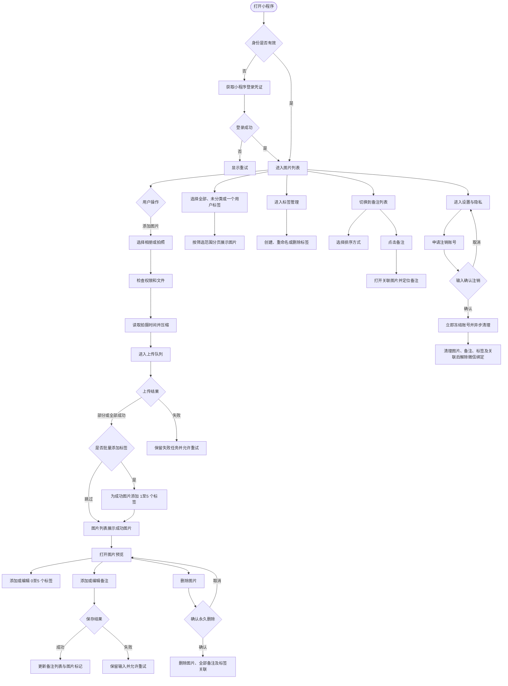

# PRD — 图片笔记小程序 V1.0.0

> 文档状态：需求评审稿
> 产品角色：AGENT-01-PRODUCT
> 产品端：微信小程序（用户端）
> 版本目标：以“简单、实用、高效、低成本”为原则，完成个人图片笔记记录、标签整理与主题回看的最小可用闭环
> 需求基线日期：2026-07-28

## 文档约定

- “已确认”表示需求方已经明确确认。
- “MVP 默认值”表示为了让原型和开发可以直接执行而给出的默认规则，可在需求评审时调整。
- 所有功能使用 `F-{NNN}` 编号，业务规则使用 `BR-{NNN}` 编号，页面使用 `PG-{NNN}` 编号，验收场景使用 `AC-{NNN}` 编号。
- 页面、功能与规则必须通过编号交叉引用，禁止在页面章节重复定义业务规则。

---

## 1. 产品概述

### 1.1 产品背景

用户经常使用照片、截图、书页照片、课件图片和灵感素材记录信息，但系统相册通常只能按图片维度浏览，传统笔记应用又要求用户先建立文字笔记再插入图片，无法同时提供“以图片为入口记录想法”和“以笔记为入口反查图片”的轻量体验。

本产品定位为个人使用的图片笔记小程序。用户可以从相册批量选择图片或直接拍照，将压缩后的图片保存至服务器，为整张图片添加多条文字备注和最多 5 个个人标签，并通过图片、备注和标签三个维度回看内容。标签用于表达图片所属主题，备注用于记录图片表达的具体内容，两者相互补充。

### 1.2 产品价值

#### 核心价值

1. **降低记录成本**：选中图片后即可添加备注，不需要创建复杂笔记结构。
2. **建立图片语义**：将用户的想法与图片绑定，使图片从“素材”转化为可回顾的个人知识记录。
3. **支持双向回顾**：既能从图片查看全部备注，也能从备注快速返回对应图片。
4. **支持主题整理**：通过个人标签聚合同一主题下跨时间、跨场景的图片，并快速识别未分类图片。
5. **跨设备保存**：图片、备注、标签和关联关系保存在服务端，同一账号可在不同设备查看。
6. **控制使用成本**：不保存原图、不提供回收站、不建设管理后台，不引入标签搜索或 AI 自动打标，降低存储、研发和维护成本。

#### 典型使用场景

- 给书页、课件或文章截图记录读书笔记。
- 给旅行、生活照片补充感受或背景信息。
- 收藏设计、装修、穿搭等参考图片并记录灵感。
- 给票据、物品或资料照片添加个人说明。
- 按“读书”“旅行”“设计”等个人标签聚合不同时间上传的图片。
- 在【未分类】中找到尚未整理的图片，并在详情中补充标签。

### 1.3 产品目标

#### 核心目标

让个人用户可以在最短路径内完成“添加图片—记录想法或归类主题—再次找到图片”的闭环；标签能力不得增加上传和默认浏览负担。

#### V1.0.0 建议验证指标

| 指标 | 目标值 | 统计口径 |
|---|---:|---|
| 图片上传成功率 | ≥ 98% | 排除用户主动取消和完全无网络场景，成功图片数/发起上传图片数 |
| 备注保存成功率 | ≥ 99% | 保存成功次数/有效保存请求次数 |
| 核心任务完成率 | ≥ 90% | 进入上传流程后，至少成功上传一张图片并保存一条备注的用户占比 |
| 单条备注完成时长 | 中位数 ≤ 30 秒 | 从进入图片预览到备注保存成功 |
| 图片与备注反向定位成功率 | ≥ 99% | 点击备注后成功打开对应图片并定位备注的次数占比 |
| 标签操作成功率 | ≥ 99% | 创建、重命名、删除、关联、移除成功请求数/有效请求数 |
| 标签筛选成功率 | ≥ 99% | 成功返回对应标签图片列表的次数/有效筛选请求次数 |
| 图片已分类率 | ≥ 60% | 已关联至少 1 个标签的有效图片数/使用过标签用户的有效图片总数 |
| 标签功能使用率 | ≥ 30% | 图片数达到 10 张且至少创建 1 个标签的用户数/图片数达到 10 张的用户数 |
| 标签反查完成率 | ≥ 95% | 点击用户标签后成功打开该标签下任一图片的会话数/有效标签筛选会话数 |

> 上述指标为 MVP 建议目标。正式上线前需结合埋点方案确认最终口径、观察周期和去重方式。

### 1.4 产品范围

#### 本版本包含

- 小程序平台身份登录及个人数据隔离。
- 从相册选择图片，单个上传批次累计最多 20 张。
- 调用相机拍照并上传。
- 图片压缩、上传进度、失败提示和重试。
- 云端图片列表和大图预览。
- 一张图片添加多条整图文字备注。
- 备注新增、修改、删除。
- 图片列表显示已备注标记及备注数量。
- 独立备注列表，支持按备注创建时间、照片拍摄时间排序。
- 从备注列表打开关联图片并定位对应备注。
- 创建、重命名和删除本人标签；单用户最多创建 100 个标签。
- 在【全部】【未分类】或任一用户标签范围内浏览图片，默认范围保持【全部】。
- 在图片详情中查看、添加或移除标签；单张图片最多关联 5 个标签。
- 上传任务全部结束后，可选地为本批成功图片统一添加标签。
- 永久删除图片并同步删除关联备注和图片标签关联。
- 在设置与隐私页查看空间用量、隐私说明并申请永久注销账号。
- 同一账号跨设备查看。
- 相册/相机权限拒绝、网络中断、上传失败、数据不存在等异常处理。

#### 本版本明确不包含

- 原图云端保存和原图下载。
- 回收站及用户自助恢复。
- 图片区域圈选、画笔、箭头、贴纸等图形标注。
- 图片分组、相册层级、标签颜色/图标/层级/自定义排序、标签搜索、图片全文搜索。
- 多标签组合筛选、标签推荐、标签合并、系统预置标签和 AI 自动打标。
- 在图片瀑布流卡片上展示标签名称。
- 批量选择历史图片后统一修改标签。
- OCR、图片识别、AI 摘要或自动生成备注。
- 图片公开发布、分享、点赞、评论或多人协作。
- 备注导出、批量导入、批量删除。
- GIF 动图、视频和文件类附件。
- 独立运营管理后台、付费扩容和会员体系。

### 1.5 产品原则

1. **简单**：主导航只保留“图片”和“备注”两个入口。
2. **实用**：优先保证上传、备注、回看和反向定位。
3. **图片优先**：进入【图片】页默认展示全部图片，标签筛选不得替代图片流。
4. **标签可选**：不要求用户在上传前或上传中选择标签，未添加标签不影响核心能力。
5. **高效**：减少页面跳转；备注和标签维护优先使用当前页操作层。
6. **轻量维护**：标签仅支持创建、重命名和删除，V1.0.0 每次仅按一个标签筛选。
7. **低成本**：仅保存压缩图；列表缩略图默认通过对象存储/CDN 动态生成；无原图、无回收站、无管理后台、无独立标签搜索服务。
8. **数据私有**：所有图片、备注、标签和关联关系默认仅本人可见。
9. **失败可恢复**：网络或服务异常不得清空用户尚未保存的备注文本或标签选择，不得把失败任务显示为成功。
10. **删除明确**：删除为不可恢复操作，必须明确告知影响范围并二次确认。

### 1.6 干系人摘要

| 干系人 | 角色类型 | 关注点 |
|---|---|---|
| 需求方/产品负责人 | 决策方 | MVP 范围、产品价值、成本控制 |
| 个人用户 | 使用方 | 快速上传、快速记录、主题整理、跨设备回看、数据私密 |
| UI/原型设计 | 下游设计方 | 页面结构、交互状态、提示文案、组件边界 |
| 小程序研发 | 实现方 | 媒体选择能力、压缩、上传队列、权限和缓存 |
| 服务端研发 | 实现方 | 身份、数据隔离、对象存储、备注与标签 CRUD、关联查询、级联删除 |
| 测试 | 验收方 | 功能边界、异常恢复、权限、幂等、数据一致性 |

### 1.7 系统上下文

| 外部系统/能力 | 关系 | 输入/输出 | 主要风险 |
|---|---|---|---|
| 微信小程序运行环境 | 载体及身份入口 | 登录凭证、基础库 API | 基础库版本和媒体选择上限变化 |
| 手机系统相册 | 图片来源 | 用户选择的本地临时文件 | 权限拒绝、格式异常、文件失效 |
| 手机相机 | 图片来源 | 拍摄生成的临时图片 | 相机权限拒绝、拍摄取消 |
| 对象存储/CDN 服务 | 图片存储与动态处理 | 压缩图上传、受控访问、动态缩略、删除 | 成本、访问控制、动态图片处理能力、上传失败 |
| 业务服务端 | 业务数据源 | 用户、图片元数据、缩略图地址、备注、标签、图片标签关联、空间用量、注销任务 | 鉴权、数据隔离、并发冲突、关联查询性能、级联清理一致性 |

---

## 2. 用户角色定义

### 2.1 角色摘要

| 角色 | 描述 | 数据范围 | 核心场景 |
|---|---|---|---|
| 个人用户 | 使用小程序保存个人图片笔记的微信用户 | 仅本人数据 | 上传图片、添加备注、维护标签、主题浏览、删除数据 |

### 2.2 权限边界

| 对象 | 查看 | 创建 | 修改 | 删除 |
|---|---|---|---|---|
| 本人图片 | 是 | 是 | 不涉及 | 是 |
| 本人备注 | 是 | 是 | 是 | 是 |
| 本人标签 | 是 | 是 | 是 | 是 |
| 本人图片标签关联 | 是 | 是 | 是 | 是 |
| 他人图片、备注、标签与关联 | 否 | 否 | 否 | 否 |

服务端必须以当前登录用户身份校验每一次读取、修改和删除请求，禁止仅依赖前端隐藏控制权限。

---

## 3. 业务流程

### 3.1 主流程交互图



### 3.2 BP-001 身份建立与数据同步

**触发条件**：用户首次打开小程序或本地会话失效。
**参与角色**：个人用户。
**前置条件**：用户可以正常使用微信。

**主流程**：

1. 小程序获取平台登录凭证。
2. 服务端校验凭证并建立当前用户身份。
3. 小程序获取本人图片列表首屏数据。
4. 图片列表加载完成。

**异常流程**：

- 登录凭证获取失败：显示“登录失败，请重试”，提供重试按钮。
- 服务端登录失败：显示“服务暂时不可用，请稍后重试”。
- 列表同步失败：保留页面框架，显示错误态和“重新加载”。

**后置条件**：用户只能读取和操作与当前身份绑定的数据。

### 3.3 BP-002 图片选择、压缩与上传

**触发条件**：用户点击“添加图片”。
**参与角色**：个人用户。
**前置条件**：身份有效，未超过个人存储额度。

**主流程**：

1. 用户选择“从相册选择”或“拍照”。
2. 系统请求对应权限。
3. 用户选择图片；当前上传批次累计不得超过 20 张。
4. 系统校验格式、单张原始文件大小和剩余空间。
5. 系统在压缩前读取照片拍摄时间；无法读取时记录为待回退。
6. 系统按规则压缩图片，不保存云端原图。
7. 图片进入上传队列，最多同时上传 3 张。
8. 单张上传成功后创建图片记录并在列表显示。
9. 全部任务结束后展示成功数和失败数。

**分支流程**：

- 微信原生选择器单次上限低于 20 张时：用户可在同一上传面板中点击“继续选择”，累计至 20 张，仍视为一个上传批次。
- 用户拍照：每次产生 1 张图片，可继续添加，累计至 20 张。
- 部分图片失败：成功图片正常入库，失败图片保留在上传面板。

**异常流程**：

- 权限拒绝：说明用途，提供“前往设置”和“取消”。
- 用户取消选择或拍照：关闭系统选择器，不显示错误。
- 不支持格式：标记具体图片并提示支持 JPG/JPEG/PNG。
- 原始文件超过 20 MB：该图片不得进入上传队列。
- 压缩失败：标记失败，允许重试或移除。
- 网络中断：进行中的任务转为失败，保留任务，网络恢复后允许重试。
- 存储空间不足：阻止新增上传并提示删除已有图片释放空间。
- 同一任务重试：不得生成重复图片记录。

**后置条件**：成功图片已保存在云端并属于当前用户；失败任务没有正式图片记录。

### 3.4 BP-003 添加和维护备注

**触发条件**：用户在图片预览页点击“添加备注”，或点击已有备注的编辑入口。
**参与角色**：个人用户。
**前置条件**：图片存在且属于当前用户。

**主流程**：

1. 系统打开备注编辑层。
2. 用户输入去除首尾 Unicode 空白后 1～1000 个 Unicode code point，支持内部换行、Emoji 和特殊 Unicode 字符。
3. 用户点击“保存”。
4. 系统校验并提交备注。
5. 保存成功后关闭编辑层，刷新当前图片备注区。
6. 图片列表和备注列表同步更新标记、数量和内容。

**异常流程**：

- 内容为空或仅为空白字符：禁止保存并提示“请输入备注内容”。
- 超过 1000 个 Unicode code point：禁止继续输入或保存，显示字符数提示。
- 图片已在其他设备删除：保存失败，提示“图片已被删除，无法添加备注”并返回列表。
- 网络或服务异常：保留编辑内容，提示“保存失败，请重试”。
- 重复点击保存：保存期间按钮禁用，避免生成重复备注。

**后置条件**：备注与图片建立关联；图片备注数量准确。

### 3.5 BP-004 从备注反向查看图片

**触发条件**：用户在备注列表点击某条备注。
**参与角色**：个人用户。
**前置条件**：备注及关联图片存在。

**主流程**：

1. 系统打开关联图片预览页。
2. 系统滚动或定位到对应备注。
3. 对目标备注进行短暂高亮。

**异常流程**：

- 图片或备注已经删除：提示“内容已不存在”，刷新备注列表并移除失效项。
- 图片加载失败：显示图片错误占位和“重新加载”，备注文本仍可显示。

### 3.6 BP-005 永久删除

**触发条件**：用户删除单条备注或图片。
**参与角色**：个人用户。

**备注删除主流程**：

1. 用户点击备注“删除”。
2. 系统显示确认提示。
3. 用户确认后永久删除备注。
4. 系统更新图片备注数量；若数量变为 0，移除已备注标记。

**图片删除主流程**：

1. 用户在图片预览页点击“删除图片”。
2. 系统展示关联备注数量及不可恢复提示，并说明图片标签关联也将移除、标签本身保留。
3. 用户确认后，服务端删除图片对象、图片记录及全部关联备注。
4. 服务端同步删除全部图片标签关联并更新相关标签的图片数量。
5. 成功后返回图片列表并刷新备注列表及当前标签筛选结果。

**异常流程**：

- 用户取消：不修改任何数据。
- 删除请求失败：原数据继续显示，提示“删除失败，请重试”。
- 重复删除同一对象：若对象已不存在，按删除成功处理并刷新页面。

### 3.7 BP-006 用户注销

**触发条件**：用户从 PG-007 设置与隐私页点击“注销账号”。
**参与角色**：个人用户。
**前置条件**：账号状态为 `ACTIVE`。

**主流程**：

1. 系统展示注销影响范围，明确账号、全部图片、备注、标签、图片标签关联和微信身份绑定将永久删除且不可恢复。
2. 用户完成首次确认后，进入文字二次确认。
3. 用户完整输入“确认注销”并提交；该文字仅用于确认高风险操作意图，不作为现实身份认证。
4. 服务端校验当前有效会话、账号状态和确认文字，创建注销任务。
5. 账号立即进入 `DELETING`，全部已有会话失效，所有业务接口停止返回图片、备注、标签和空间数据。
6. 后台依次删除图片对象、图片记录、备注、标签、图片标签关联及其他用户关联数据，并将空间用量归零。
7. 全部清理成功后，账号进入 `DELETED`，删除平台身份标识与账号的绑定关系。

**异常流程**：

- 确认文字不完整或不一致：禁止提交，提示“请输入完整的‘确认注销’”。
- 重复提交注销：已处于 `DELETING` 时返回现有注销任务状态，不创建重复任务。
- 清理部分失败：账号保持 `DELETING` 且不可使用，注销任务进入重试中并自动继续清理。
- `DELETING` 用户再次进入：直接进入 PG-008，仅展示处理中说明和“联系客服”，不得加载原业务数据。
- 清理完成后再次进入：原微信绑定已删除，按新用户创建全新空账号。

**后置条件**：注销不可撤销；清理完成后原账号及其业务数据不可恢复或再次访问。

### 3.8 BP-007 标签筛选与图片回看

**触发条件**：用户进入 PG-002 或点击某个筛选项。
**参与角色**：个人用户。
**前置条件**：账号状态为 `ACTIVE`。

**主流程**：

1. 用户进入 PG-002。
2. 系统默认选中【全部】，加载全部图片首屏。
3. 系统加载本人标签，并根据标签总数展示对应的快捷标签和管理入口。
4. 用户点击【未分类】或某个用户标签。
5. 系统重置图片分页并按当前筛选条件加载首屏。
6. 用户点击图片进入 PG-004。
7. 用户返回 PG-002 时，当前会话保留筛选条件、已加载列表和滚动位置。

**分支流程**：

- 用户点击【全部】：加载本人全部有效图片。
- 用户点击【未分类】：仅加载没有任何有效标签关联的图片。
- 用户没有自定义标签时：显示【＋新建标签】；创建成功后新标签自动成为当前筛选项。
- 用户有 1～5 个自定义标签时：展示全部自定义标签和【管理】；点击【管理】进入 PG-009。
- 用户有 6～100 个自定义标签时：展示最近使用的 5 个标签和【更多】；点击【更多】进入 PG-009。
- 用户从 PG-009 点击某个标签后：返回 PG-002 并以该标签筛选。
- 小程序冷启动或新会话首次进入 PG-002：始终恢复为【全部】。

**异常流程**：

- 标签列表加载失败：全部图片仍可浏览；标签区显示轻量错误和重试入口。
- 图片筛选失败：保留当前已选筛选项，列表显示错误态和重试。
- 当前标签已在其他设备删除：提示“标签已不存在”，刷新标签区并切换到【全部】。
- 筛选结果为空：显示对应空态，不自动切换筛选项。

**后置条件**：用户看到的图片均属于本人，并符合当前唯一筛选条件。

### 3.9 BP-008 单张图片标签维护

**触发条件**：用户在 PG-004 点击标签区域的“添加”或“编辑”。
**参与角色**：个人用户。
**前置条件**：图片存在且属于当前用户，账号状态为 `ACTIVE`。

**主流程**：

1. 系统打开 PG-010。
2. 系统加载当前图片已关联标签和本人标签列表。
3. 用户勾选或取消勾选标签，最多选中 5 个。
4. 用户可在 PG-010 内创建新标签；创建成功后新标签自动选中。
5. 用户点击“保存”。
6. 服务端按增量方式添加、移除关联关系。
7. 保存成功后关闭 PG-010，刷新 PG-004 标签区。
8. 其他页面在下次显示或刷新时同步最新标签和筛选结果。

**异常流程**：

- 图片已在其他设备删除：禁止保存，提示“图片已被删除或不存在”，关闭编辑层并返回图片列表。
- 已选标签在其他设备被删除：保留其他选择，刷新标签列表并提示“部分标签已不存在，请重新确认”。
- 保存时网络或服务异常：保持 PG-010 打开并保留未提交选择，允许重试。
- 重复点击保存：保存期间按钮禁用，不得创建重复关联。
- 用户取消或关闭：不修改图片标签；本次未保存选择不跨页面和跨会话保留。

**后置条件**：图片拥有 0～5 个有效标签；图片与标签关系不重复。

### 3.10 BP-009 标签创建、重命名与删除

**触发条件**：用户从 PG-009 或 PG-010 发起标签维护。
**参与角色**：个人用户。
**前置条件**：账号状态为 `ACTIVE`。

**创建标签主流程**：

1. 用户点击“新建标签”并输入名称。
2. 前后端按 BR-032～BR-036 校验。
3. 创建成功后刷新标签列表；若从 PG-010 创建，新标签自动选中。

**重命名标签主流程**：

1. 用户在 PG-009 对某个标签点击“重命名”。
2. 系统显示原名称并允许编辑。
3. 服务端校验并更新标签。
4. 所有引用位置显示新名称，图片关联关系保持不变。

**删除标签主流程**：

1. 用户在 PG-009 对某个标签点击“删除”。
2. 系统展示标签名称、关联图片数量和“不删除图片”的说明。
3. 用户确认后，服务端删除标签及全部图片标签关联。
4. 原本仅关联该标签的图片进入【未分类】。
5. 页面刷新标签列表和相关图片数量。

**异常流程**：

- 名称为空、超长、包含换行或控制字符：禁止提交并显示对应提示。
- 名称与本人已有标签重复或命中系统保留名称：禁止创建或重命名。
- 标签总数达到 100：禁止创建，提示先删除不需要的标签。
- 标签已被其他设备删除：删除按成功处理，重命名提示标签失效并刷新列表。
- 删除或重命名失败：页面数据不提前变化，保留输入并允许重试。

### 3.11 BP-010 上传成功图片批量添加标签

**触发条件**：PG-003 中当前批次所有任务均已结束，且至少 1 张图片上传成功。
**参与角色**：个人用户。
**前置条件**：账号状态为 `ACTIVE`。

**主流程**：

1. 上传面板展示成功数和失败数，并提供“为本批图片添加标签”和“完成”。
2. 用户点击“为本批图片添加标签”，打开 PG-010。
3. 用户选择 1～5 个标签，或创建新标签。
4. 服务端为本批全部成功图片添加所选标签。
5. 成功后返回 PG-003，显示“已为 N 张图片添加标签”。
6. 用户点击“完成”关闭上传面板并刷新 PG-002。

**分支流程**：

- 用户点击“完成”：跳过添加标签，不影响成功图片。
- 批次部分失败：仅成功入库的图片参与批量关联。
- 失败任务后续重试成功：视为新的成功结果，不自动继承此前已完成的批量标签操作。

**异常流程**：

- 批量关联失败：PG-010 保持打开并保留选择，允许重试或取消。
- 请求重复提交或成功回调重复：同一图片与标签仅保留一条有效关联。
- 部分图片已被其他设备删除：不为失效图片创建关联，并返回明确的成功数和失效数。

**后置条件**：成功处理的图片均关联相同标签；上传失败或取消任务没有图片标签关联。

---

## 4. 数据实体定义

### 4.1 实体清单

| 实体 | 核心属性 | 说明 |
|---|---|---|
| 用户 User | 用户 ID、平台身份标识、账号状态、存储已用量、空间上限、创建时间、最近登录时间 | 数据归属主体 |
| 图片 Photo | 图片 ID、用户 ID、压缩图地址、缩略图地址、文件大小、宽高、格式、拍摄时间、时间来源、上传时间、备注数量 | 云端保存的压缩图片及元数据；详情返回标签摘要 |
| 备注 Note | 备注 ID、用户 ID、图片 ID、内容、创建时间、更新时间 | 针对整张图片的文字记录 |
| 标签 Tag | 标签 ID、用户 ID、标签名称、规范化名称、关联图片数量、最近使用时间、创建时间、更新时间 | 用户创建的个人主题标识 |
| 图片标签关联 PhotoTag | 关联 ID、用户 ID、图片 ID、标签 ID、创建时间 | 表达图片与标签的多对多关系 |
| 上传任务 UploadTask | 本地任务 ID、批次 ID、临时文件、状态、进度、失败原因、重试次数 | 客户端临时实体，成功后可清理 |
| 注销任务 AccountDeletionTask | 注销任务 ID、用户 ID、状态、失败阶段、重试次数、申请时间、完成时间 | 记录账号冻结与异步级联清理进度 |

### 4.2 实体关系

- 用户 `1:N` 图片。
- 用户 `1:N` 备注。
- 图片 `1:N` 备注。
- 用户 `1:N` 标签。
- 图片 `N:M` 标签，通过图片标签关联表达。
- 一个用户标签可关联 `0:N` 张本人图片；一张图片可关联 `0:5` 个本人标签。
- 图片、标签和图片标签关联的用户 ID 必须一致。
- 【全部】和【未分类】为查询口径，不创建标签实体。
- 一个上传批次 `1:N` 上传任务。
- 上传任务成功后对应 `1:1` 图片；失败或取消时不生成图片。
- 用户同一时间最多存在 `0:1` 个未完成注销任务。

### 4.3 核心属性说明

#### 用户 User

| 属性 | 必填 | 说明 |
|---|---|---|
| 用户 ID | 是 | 服务端唯一标识 |
| 平台身份标识 | 是 | 与微信身份的受保护绑定标识；注销清理完成后删除 |
| 账号状态 | 是 | `ACTIVE`、`DELETING` 或 `DELETED` |
| 存储已用量 | 是 | `used_bytes`，有效压缩图片对象的总字节数 |
| 空间上限 | 是 | `limit_bytes`，MVP 默认 500 MB |

#### 图片 Photo

| 属性 | 必填 | 说明 |
|---|---|---|
| 图片 ID | 是 | 服务端唯一标识 |
| 用户 ID | 是 | 数据所有者 |
| 压缩图地址 | 是 | 私有对象存储地址或受控访问标识 |
| 缩略图地址 | 是 | 服务端基于动态图片处理能力生成的受控 `thumbnail_url` |
| 文件大小 | 是 | 压缩后字节数，用于空间统计 |
| 宽度/高度 | 是 | 压缩后尺寸 |
| 格式 | 是 | JPG/JPEG/PNG |
| 拍摄时间 | 是 | EXIF 拍摄时间；无法获取时使用上传时间 |
| 时间来源 | 是 | `EXIF` 或 `UPLOAD_TIME` |
| 上传时间 | 是 | 服务端成功创建记录的时间 |
| 备注数量 | 是 | 非负整数，默认 0；必须与有效备注数一致 |

#### 备注 Note

| 属性 | 必填 | 说明 |
|---|---|---|
| 备注 ID | 是 | 服务端唯一标识 |
| 用户 ID | 是 | 数据所有者 |
| 图片 ID | 是 | 关联图片 |
| 内容 | 是 | 去除首尾 Unicode 空白后 1～1000 个 Unicode code point |
| 创建时间 | 是 | 首次保存的服务端时间 |
| 更新时间 | 是 | 最近一次保存的服务端时间 |

#### 标签 Tag

| 属性 | 必填 | 说明 |
|---|---:|---|
| 标签 ID | 是 | 服务端唯一标识 |
| 用户 ID | 是 | 标签所有者，用于数据隔离 |
| 标签名称 | 是 | 用户看到的原始展示名称 |
| 规范化名称 | 是 | 用于本人范围内唯一性校验，不直接展示 |
| 关联图片数量 | 是 | 当前有效关联图片数，非负整数 |
| 最近使用时间 | 是 | 最近一次成功筛选或成功关联图片的服务端时间 |
| 创建时间 | 是 | 服务端创建时间 |
| 更新时间 | 是 | 最近一次重命名或业务更新的服务端时间 |

#### 图片标签关联 PhotoTag

| 属性 | 必填 | 说明 |
|---|---:|---|
| 关联 ID | 是 | 服务端唯一标识，或由图片 ID 与标签 ID 形成唯一关系 |
| 用户 ID | 是 | 关联关系所有者，必须与图片、标签所有者一致 |
| 图片 ID | 是 | 关联的有效图片 |
| 标签 ID | 是 | 关联的有效标签 |
| 创建时间 | 是 | 关联成功的服务端时间 |

标签和图片标签关联不设计独立业务状态机；有效性由实体是否存在及归属关系决定。

### 4.4 上传任务状态机

**状态枚举**：待处理、压缩中、待上传、上传中、成功、失败、已取消。

| 当前状态 ╲ 操作 | 开始压缩 | 压缩成功 | 开始上传 | 上传成功 | 发生错误 | 重试 | 取消 |
|---|---|---|---|---|---|---|---|
| 待处理 | → 压缩中 | ✗ | ✗ | ✗ | → 失败 | ✗ | → 已取消 |
| 压缩中 | ✗ | → 待上传 | ✗ | ✗ | → 失败 | ✗ | → 已取消 |
| 待上传 | ✗ | ✗ | → 上传中 | ✗ | → 失败 | ✗ | → 已取消 |
| 上传中 | ✗ | ✗ | ✗ | → 成功 | → 失败 | ✗ | → 已取消 |
| 成功 | ✗ | ✗ | ✗ | ✗ | ✗ | ✗ | ✗ |
| 失败 | ✗ | ✗ | ✗ | ✗ | ✗ | → 待处理 | → 已取消 |
| 已取消 | ✗ | ✗ | ✗ | ✗ | ✗ | ✗ | ✗ |

### 4.5 用户与注销任务状态机

#### 用户状态机

**状态枚举**：`ACTIVE`、`DELETING`、`DELETED`。

| 当前状态 ╲ 操作 | 提交注销 | 清理完成 | 访问业务数据 | 重新进入 |
|---|---|---|---|---|
| `ACTIVE` | → `DELETING` | ✗ | 允许 | 进入 PG-002 |
| `DELETING` | 返回已有任务 | → `DELETED` | 拒绝 | 进入 PG-008 |
| `DELETED` | ✗ | ✗ | 拒绝 | 按新用户重新建立空账号 |

#### 注销任务状态机

**状态枚举**：待处理、处理中、重试中、已完成。

| 当前状态 ╲ 事件 | 开始清理 | 阶段失败 | 自动重试 | 全部清理成功 |
|---|---|---|---|---|
| 待处理 | → 处理中 | ✗ | ✗ | ✗ |
| 处理中 | ✗ | → 重试中 | ✗ | → 已完成 |
| 重试中 | ✗ | ✗ | → 处理中 | ✗ |
| 已完成 | ✗ | ✗ | ✗ | ✗ |

### 4.6 数据权限

| 实体 | 角色 | 查看范围 | 操作权限 |
|---|---|---|---|
| 用户 | 个人用户 | 仅本人；`DELETING` 时仅可查看注销状态 | 查看空间、申请注销 |
| 图片 | 个人用户 | 仅本人 | 创建、查看、删除 |
| 备注 | 个人用户 | 仅本人且关联本人图片 | 创建、查看、修改、删除 |
| 标签 | 个人用户 | 仅本人 | 创建、查看、重命名、删除 |
| 图片标签关联 | 个人用户 | 仅本人且图片、标签均属于本人 | 创建、查看、删除 |
| 上传任务 | 个人用户 | 当前设备当前会话 | 创建、查看、重试、取消 |
| 注销任务 | 个人用户 | 仅本人当前未完成任务 | 创建、查看状态，不可撤销 |

服务端必须基于当前登录用户校验标签、图片及关联关系，禁止信任客户端传入的用户 ID，禁止通过标签 ID 推断或返回其他用户数据。

### 4.7 标签生命周期与级联规则

| 触发动作 | 标签 | 图片 | 图片标签关联 |
|---|---|---|---|
| 创建标签 | 新增 | 不变 | 不变 |
| 重命名标签 | 名称更新 | 不变 | 不变 |
| 删除标签 | 删除 | 不删除 | 删除该标签的全部关联 |
| 删除图片 | 不删除 | 删除 | 删除该图片的全部关联 |
| 注销账号 | 全部删除 | 按 F-015 删除 | 全部删除 |

---

## 5. 功能需求清单

### 5.1 功能总览

| 模块 | 功能编号 | 功能名称 | 优先级 | 所属端 | 关联页面 |
|---|---|---|---:|---|---|
| 身份与同步 | F-001 | 身份建立与个人数据隔离 | P0 | 用户端小程序 | PG-001、PG-002 |
| 图片上传 | F-002 | 相册选择图片 | P0 | 用户端小程序 | PG-002、PG-003 |
| 图片上传 | F-003 | 拍照上传 | P0 | 用户端小程序 | PG-002、PG-003 |
| 图片上传 | F-004 | 图片压缩与批量上传 | P0 | 用户端小程序 | PG-003 |
| 图片浏览 | F-005 | 图片列表 | P0 | 用户端小程序 | PG-002 |
| 图片浏览 | F-006 | 图片预览与详情 | P0 | 用户端小程序 | PG-004 |
| 备注管理 | F-007 | 新增备注 | P0 | 用户端小程序 | PG-004、PG-005 |
| 备注管理 | F-008 | 修改和删除备注 | P0 | 用户端小程序 | PG-004、PG-005 |
| 备注管理 | F-009 | 已备注标记及数量 | P1 | 用户端小程序 | PG-002 |
| 备注浏览 | F-010 | 备注列表及排序 | P1 | 用户端小程序 | PG-006 |
| 备注浏览 | F-011 | 备注反向定位图片 | P1 | 用户端小程序 | PG-006、PG-004 |
| 删除 | F-012 | 永久删除图片及关联备注 | P0 | 用户端小程序 | PG-004 |
| 异常恢复 | F-013 | 上传失败重试与状态恢复 | P0 | 用户端小程序 | PG-003 |
| 隐私合规 | F-014 | 隐私说明与能力授权 | P0 | 用户端小程序 | PG-001、PG-003 |
| 隐私合规 | F-015 | 用户注销 | P0 | 用户端小程序 | PG-007、PG-008 |
| 标签浏览 | F-016 | 标签浏览与图片筛选 | P1 | 用户端小程序 | PG-002、PG-009 |
| 标签管理 | F-017 | 标签创建、重命名与删除 | P1 | 用户端小程序 | PG-009、PG-010 |
| 标签管理 | F-018 | 单张图片标签维护 | P1 | 用户端小程序 | PG-004、PG-010 |
| 标签管理 | F-019 | 上传成功图片批量添加标签 | P1 | 用户端小程序 | PG-003、PG-010 |

### 5.2 操作及数据权限矩阵

| 功能 | 未建立身份 | 已建立身份的个人用户 |
|---|---:|---:|
| 查看本人图片/备注/标签 | 否 | 是 |
| 选择及上传图片 | 否 | 是 |
| 新增、修改、删除本人备注 | 否 | 是 |
| 创建、重命名、删除本人标签 | 否 | 是 |
| 添加、移除本人图片标签 | 否 | 是 |
| 删除本人图片 | 否 | 是 |
| 查看本人空间与隐私设置 | 否 | 是 |
| 注销本人账号 | 否 | 是 |
| 访问他人数据 | 否 | 否 |

> 账号进入 `DELETING` 或 `DELETED` 后，上表中的全部业务操作均为“否”，仅允许查询本人注销任务状态。

### 5.3 业务规则清单

| 规则编号 | 类型 | 适用对象 | 规则描述 |
|---|---|---|---|
| BR-001 | 准入 | 全部数据 | 图片、备注、标签及关联必须绑定当前用户，用户只能访问本人数据 |
| BR-002 | 校验 | 上传批次 | 一个上传批次累计最多 20 张，最少 1 张 |
| BR-003 | 例外 | 媒体选择 | 原生选择器上限不足 20 张时，允许在同一上传面板中多次选择，累计不超过 20 张 |
| BR-004 | 校验 | 图片 | 仅支持 JPG、JPEG、PNG 静态图片 |
| BR-005 | 校验 | 图片 | 单张原始图片不得超过 20 MB |
| BR-006 | 校验 | 压缩 | 最长边不超过 2560 px，保持宽高比；JPEG 初始质量 85%，压缩后目标不超过 3 MB |
| BR-007 | 成本 | 图片 | 服务端仅保存压缩图，不保存原图；列表缩略图默认动态生成，不额外保存独立缩略图副本 |
| BR-008 | 口径 | 拍摄时间 | 压缩前优先读取 EXIF 拍摄时间；缺失或无效时使用上传时间，记录时间来源 |
| BR-009 | 流转 | 上传队列 | 最多同时上传 3 张，其余排队 |
| BR-010 | 例外 | 批量上传 | 单张失败不影响其他图片；结束后汇总成功数和失败数 |
| BR-011 | 幂等 | 上传任务 | 同一上传任务重试不得创建重复图片记录 |
| BR-012 | 成本/交互 | 用户空间 | MVP 默认每用户 500 MB，可由服务端配置；使用率达到 85% 且低于 100% 时按规则软性预警，达到 100% 时禁止新上传 |
| BR-013 | 校验 | 备注 | 一张图片可有多条备注；每条备注针对整张图片 |
| BR-014 | 校验 | 备注内容 | 去除首尾 Unicode 空白后按 Unicode code point 计数，长度为 1～1000；支持内部换行、Emoji 和特殊 Unicode 字符，前后端使用同一口径 |
| BR-015 | 口径 | 备注时间 | 修改备注不改变创建时间，只更新修改时间 |
| BR-016 | 展示 | 图片标记 | 0 条备注不显示标记；1 条显示已备注图标；2 条及以上显示图标和数量 |
| BR-017 | 排序 | 备注列表 | 默认按备注创建时间从新到旧 |
| BR-018 | 排序 | 备注列表 | 支持备注时间最新/最早、照片拍摄时间最新/最早四种方式 |
| BR-019 | 删除 | 备注 | 删除备注后更新备注数量；删除最后一条后移除图片标记 |
| BR-020 | 删除 | 图片 | 删除图片时永久删除图片对象、全部关联备注和图片标签关联，不删除标签本身，不提供回收站 |
| BR-021 | 交互 | 删除 | 永久删除前必须二次确认；服务端失败时不得提前移除本地展示数据 |
| BR-022 | 同步/并发 | 备注修改 | 云端数据为权威数据；修改请求必须携带上次读取的 `updated_at`，与服务端当前值不一致时拒绝自动覆盖并进入冲突处理 |
| BR-023 | 异常 | 备注保存 | 保存失败时保留用户输入，允许原地重试 |
| BR-024 | 隐私 | 图片能力 | 调用相册或相机前完成所需隐私说明和授权处理 |
| BR-025 | 生命周期 | 上传任务 | 关闭 PG-003、离开上传页面或小程序进入后台时，成功任务保留，其他任务均转为已取消；后台运行时长及相关 API 可用性不作保证 |
| BR-026 | 交互 | 备注冲突 | 冲突时编辑层保持打开并保留当前输入，用户可加载最新内容或明确确认后继续提交覆盖；关闭编辑层后不跨页面或跨会话保存冲突草稿 |
| BR-027 | 合规/删除 | 用户注销 | 用户输入完整“确认注销”后立即冻结账号并异步清理全部业务数据；全部清理成功后解除微信绑定，注销不可撤销 |
| BR-028 | 性能/成本 | 列表缩略图 | 缩略图必须由对象存储/CDN 动态图片处理能力生成并由服务端统一提供受控 `thumbnail_url`；前端不得加载 2560 px 预览图或硬编码厂商参数 |
| BR-029 | 准入/权限 | 标签及关联 | 标签仅属于创建用户；标签、图片和关联的所有操作必须校验当前用户 |
| BR-030 | 口径 | 虚拟集合 | 【全部】表示本人全部有效图片；【未分类】表示没有任何有效标签关联的本人图片 |
| BR-031 | 校验 | 图片标签 | 单张图片允许关联 0～5 个标签，标签非必填 |
| BR-032 | 校验 | 标签名称 | 去除首尾 Unicode 空白后为 1～12 个 Unicode code point |
| BR-033 | 校验 | 标签名称 | 不允许换行符、回车符、制表符及其他 Unicode 控制字符 |
| BR-034 | 唯一性 | 标签名称 | 同一用户下标签规范化名称唯一；执行 Unicode NFC 规范化并忽略拉丁字母大小写，展示时保留提交名称 |
| BR-035 | 保留名称 | 标签名称 | 用户不得创建或重命名为“全部”“未分类”，避免与系统虚拟集合混淆 |
| BR-036 | 数量 | 用户标签 | 每位用户最多创建 100 个有效标签 |
| BR-037 | 交互 | 新建标签 | 在 PG-010 创建标签成功后自动选中；若已选 5 个则创建成功但不自动选中，并提示上限 |
| BR-038 | 交互 | 标签选择 | 达到 5 个后禁用其他未选标签；取消任一已选标签后恢复选择 |
| BR-039 | 排序 | 用户标签 | 用户标签按最近使用时间降序；时间相同时按更新时间、创建时间降序 |
| BR-040 | 口径 | 最近使用 | 成功使用标签筛选，或成功将标签关联至图片时更新最近使用时间；仅查看、取消选择或失败请求不更新 |
| BR-041 | 展示 | 快捷标签 | PG-002 固定展示【全部】【未分类】，其余入口按用户标签总数自适应：0 个显示【＋新建标签】；1～5 个展示全部用户标签及【管理】；6～100 个展示最近使用的 5 个用户标签及【更多】 |
| BR-042 | 筛选 | 图片列表 | 每次仅允许【全部】【未分类】或一个用户标签生效，不支持多标签组合 |
| BR-043 | 交互 | 图片卡片 | 图片瀑布流卡片不展示标签名称，继续仅展示图片和备注标记 |
| BR-044 | 修改 | 标签重命名 | 重命名后全部关联图片立即引用新名称，关联关系不变 |
| BR-045 | 删除 | 标签 | 删除标签仅删除标签及关联关系，不删除图片或备注 |
| BR-046 | 删除 | 标签 | 图片失去最后一个标签后自动符合【未分类】查询口径 |
| BR-047 | 删除 | 图片/账号 | 删除图片清理该图片全部标签关联；账号注销清理本人全部标签及关联 |
| BR-048 | 幂等 | 图片标签关联 | 图片与同一标签只能存在一条有效关联；重复请求不得生成重复关系或重复计数 |
| BR-049 | 批量 | 上传成功图片 | 批量添加仅作用于当前批次已成功入库的图片，不作用于失败、取消或处理中任务 |
| BR-050 | 批量 | 图片标签关联 | 批量添加使用集合合并语义；重复标签不重复增加，每张图片合并后不得超过 5 个 |
| BR-051 | 异常 | 标签操作 | 操作失败不得提前改变服务端权威结果；编辑层保留未提交选择并允许重试 |
| BR-052 | 同步 | 标签数据 | 进入 PG-009、下拉刷新及跨页面刷新时以服务端数据为准 |
| BR-053 | 生命周期 | 标签筛选 | 同一小程序会话内从详情返回时保留筛选和滚动位置；冷启动或新会话默认【全部】 |
| BR-054 | 数据一致性 | 关联计数 | 标签关联图片数量必须与有效关联一致，不得为负；服务端操作成功后返回最新数量 |

**BR-012 空间预警补充规则**：

- 当前会话首次进入 PG-002 且使用率已达到 85% 时提示。
- 成功上传后，使用率由低于 85% 变为达到或超过 85% 时提示。
- 同一小程序会话最多提示一次；用户关闭后，本会话内不再重复提示，新会话重新判断。
- 提示为非阻塞式顶部或底部信息：`云端空间即将用满，请及时清理旧图片。`

**BR-028 替代方案约束**：

- 动态处理参数可参考 `?imageMogr2/thumbnail/!200x200r`，该示例不构成固定厂商或固定语法要求。
- 若所选存储服务不具备动态处理能力，技术方案必须提供预生成约 200 px 缩略图副本等替代方案并经产品确认。
- 无法提供满足列表性能要求的缩略图时，视为技术方案不可行。

**标签名称规范化示例**：

| 用户输入 | 去除首尾空白后的展示名称 | 唯一性比较结果 |
|---|---|---|
| ` 读书 ` | `读书` | 与 `读书` 重复 |
| `Travel` | `Travel` | 与 `travel` 重复 |
| `产品 设计` | `产品 设计` | 内部普通空格保留 |
| `全部` | `全部` | 系统保留名称，不允许创建 |
| `读书\n笔记` | 不适用 | 包含换行，不允许创建 |

**通用规则覆盖说明**：

- 标签名称输入覆盖文本框默认最多 50 字规则，改为去除首尾 Unicode 空白后 1～12 个 Unicode code point；影响 PG-009、PG-010。
- 标签筛选覆盖查询区默认查询/重置按钮规则，采用即时单选；点击【全部】等同清除标签筛选；影响 PG-002。
- 图片列表分页继续覆盖通用列表每页 10 条规则，采用基线每页 20 张及触底分页；影响 PG-002。

### 5.4 F-001 身份建立与个人数据隔离

- **用户故事**：作为个人用户，我想要自动建立与微信身份绑定的个人空间，以便跨设备查看且不泄露给其他用户。
- **前置条件**：用户从微信进入小程序。
- **操作权限**：无需预先登录；身份建立后仅操作本人数据。
- **主流程**：获取登录凭证 → 服务端换取/校验身份 → 创建或读取用户 → 返回会话 → 加载本人数据。
- **交互说明**：
  - 加载态：启动页或页面骨架屏。
  - 成功反馈：无额外成功弹窗，直接进入图片列表。
  - 失败反馈：错误页显示“登录失败，请重试”。
  - 空态：身份成功但无图片时进入图片空态。
  - 确认机制：不获取非必要头像、昵称和手机号。
- **异常流程**：凭证无效、服务不可用、会话过期均重新发起身份建立；禁止展示上一个用户的缓存数据。

### 5.5 F-002/F-003 相册选择与拍照

- **用户故事**：作为个人用户，我想从相册选择或直接拍摄图片，以便快速创建图片笔记。
- **入口**：图片列表主按钮“添加图片”。
- **主流程**：打开来源选择层 → 选择相册或拍照 → 授权 → 获取临时图片 → 加入上传面板。
- **输入分解**：

| 输入变量 | 等价类 | 引用规则 |
|---|---|---|
| 来源 | 相册、相机 | BR-024 |
| 权限 | 已授权、首次请求、已拒绝 | BR-024 |
| 批次数量 | 1、20、超过 20 | BR-002/BR-003 |
| 格式 | JPG/JPEG/PNG、其他 | BR-004 |
| 单张大小 | ≤20 MB、>20 MB | BR-005 |

- **异常流程**：
  - 权限已拒绝：显示用途说明及设置入口。
  - 用户主动取消：静默返回，不提示错误。
  - 超过剩余可选数量：限制继续选择并提示“本批次最多添加 20 张”。
  - 混入不支持文件：有效图片保留，无效图片逐项标记。

### 5.6 F-004/F-013 图片压缩、上传及恢复

- **用户故事**：作为个人用户，我想看到每张图片的处理进度，并能重试失败项，以便确认哪些图片已经安全保存。
- **主流程**：读取元数据 → 校验 → 压缩 → 排队 → 上传对象 → 创建图片记录 → 成功。
- **上传面板要求**：
  - 显示已选数量 `N/20`。
  - 每张显示缩略预览、状态、进度和失败原因。
  - 支持移除未成功任务、继续选择、全部上传、重试失败项。
  - 上传期间关闭面板、离开页面或小程序进入后台前，提示：`退出后，未完成任务将取消，已上传成功的图片会保留。请保持小程序在前台直到上传完成。`
  - 用户确认离开后，成功任务保留；待处理、压缩中、待上传、上传中和失败任务均转为已取消并停止后续处理。
- **成功反馈**：`已成功上传 N 张`；部分失败时显示 `成功 N 张，失败 M 张`。
- **上传后标签入口**：当前批次全部任务结束且至少 1 张成功时，结果区显示“为本批图片添加标签”和“完成”；标签步骤可跳过，不改变成功、失败、重试或取消状态。
- **失败反馈**：失败项保留，提供“重试”。
- **异常流程**：
  - 压缩后仍超过目标大小：继续降低质量；达到实现约定最低质量后仍失败则提示无法处理。
  - 网络切换/中断：上传中任务失败，可重试。
  - 任务取消后收到迟到回调：忽略业务记录创建；已上传但未入库的孤立对象进入清理任务。
  - 对象上传成功但业务记录创建失败：重试创建记录或清理孤立对象，用户端仍显示失败。
  - 重复回调：以任务幂等标识确保只创建一条图片记录。

### 5.7 F-005 图片列表

- **用户故事**：作为个人用户，我想浏览已上传图片及备注状态，以便快速找到需要回看的内容。
- **展示内容**：服务端返回的约 200 px `thumbnail_url`、已备注图标/数量；列表不得请求 2560 px 预览图。
- **筛选范围**：默认【全部】；支持【未分类】或单个用户标签，引用 BR-030、BR-041～BR-043。
- **默认顺序**：各筛选范围内均按上传时间从新到旧；V1.0.0 不提供图片列表排序切换。
- **布局建议**：两列等宽瀑布流或自适应网格，优先完整展示图片比例。
- **交互说明**：
  - 点击图片：进入 PG-004 图片预览。
  - 点击顶部导航栏右侧设置图标：进入 PG-007。
  - 点击标签筛选项：重置分页并加载对应图片；同会话从详情返回时保留筛选、已加载列表和滚动位置。
  - 下拉刷新：同步云端最新数据。
  - 触底：加载下一页。
  - 加载态：图片骨架块，缩略图渐进展示。
  - 下拉刷新态：保留现有列表和卡片布局，仅显示刷新指示器并差量更新，禁止整页清空或闪白。
  - 空间预警：引用 BR-012，同一会话最多显示一次。
  - 空态：【全部】显示“还没有图片”；【未分类】显示“所有图片都已添加标签”；用户标签显示“这个标签下还没有图片”。
  - 错误态：“图片加载失败，点击重试”。
- **分页默认值**：每页 20 张。

### 5.8 F-006 图片预览与详情

- **用户故事**：作为个人用户，我想查看大图及其全部备注，以便阅读和管理围绕图片记录的想法。
- **展示内容**：大图、拍摄时间、全部已关联标签、全部备注、备注创建时间；修改过的备注可显示“已编辑”。
- **操作**：添加或编辑标签、添加备注、编辑备注、删除备注、删除图片、返回。
- **交互说明**：
  - 图片支持双指缩放和拖动查看。
  - 备注默认按创建时间从新到旧。
  - 从备注列表进入时定位并短暂高亮目标备注。
  - 图片加载失败时，备注仍可展示；提供重新加载图片。
  - 图片不存在时提示并返回列表。
  - 标签区位于拍摄时间与备注区之间；无标签时显示“还没有标签”和“添加标签”，有标签时完整展示并提供“编辑”。

### 5.9 F-007/F-008 新增、修改与删除备注

- **用户故事**：作为个人用户，我想为图片记录多条想法并随时修订，以便持续完善图片笔记。
- **编辑组件**：底部编辑层，包含多行文本、字数 `已输入/1000`、取消、保存。
- **保存规则**：引用 BR-013～BR-015、BR-023。
- **删除提示**：`确定永久删除这条备注吗？删除后无法恢复。`
- **交互说明**：
  - 保存期间按钮禁用并显示加载状态。
  - 保存成功：关闭编辑层，Toast“保存成功”。
  - 保存失败：编辑层保持打开，内容不清空。
  - 修改备注时必须携带上次读取的 `updated_at`；冲突处理引用 BR-022、BR-026。
  - 冲突提示：`内容已在其他设备更新，请选择处理方式`，编辑层保持打开并保留本地输入。
  - “加载最新内容”：先提示本地修改将丢失，确认后加载云端最新内容及 `updated_at`。
  - “继续提交”：先提示将覆盖其他设备的最新修改；确认后保留本地内容，取得最新 `updated_at` 并覆盖保存。
  - 继续提交期间再次冲突：保持编辑层和本地输入，重新展示冲突处理。
  - 用户关闭编辑层：本地冲突内容不跨页面或跨会话保存。
  - 删除成功：Toast“已删除”并更新列表。

### 5.10 F-009 已备注标记

- **用户故事**：作为个人用户，我想在图片列表快速识别哪些图片已经记录过想法。
- **展示规则**：引用 BR-016。
- **视觉要求**：
  - 标记位于图片卡片固定角落，不遮挡主要内容。
  - 数量建议显示实际数量；超过 99 时显示 `99+`。
  - 标记必须具备足够对比度。

### 5.11 F-010/F-011 备注列表、排序与反向定位

- **用户故事**：作为个人用户，我想像浏览读书笔记一样浏览全部备注，并从任一备注回到原图。
- **列表字段**：图片缩略图、备注内容、备注创建时间。
- **缩略图来源**：使用服务端返回的约 200 px `thumbnail_url`，引用 BR-028。
- **内容展示**：备注最多展示 3 行，超出省略；点击整行进入图片。
- **排序方式**：
  - 备注时间：最新优先（默认）。
  - 备注时间：最早优先。
  - 照片拍摄时间：最新优先。
  - 照片拍摄时间：最早优先。
- **状态处理**：
  - 加载态：缩略图和文本骨架屏。
  - 空态：“还没有备注，去图片中记录第一条想法”。
  - 错误态：“备注加载失败，点击重试”。
  - 关联内容失效：刷新时移除失效项并提示。
- **分页默认值**：每页 20 条。

### 5.12 F-012 永久删除图片及关联备注

- **用户故事**：作为个人用户，我想删除不再需要的图片及其全部备注和标签关联，以便释放存储空间并保持数据一致。
- **入口**：图片预览页更多操作，不在图片列表提供批量删除。
- **确认文案**：`确定永久删除这张图片吗？图片关联的 N 条备注和全部标签关联也将同时删除，标签本身保留。删除后无法恢复。`
- **主流程**：确认 → 服务端鉴权 → 删除对象、图片记录、备注和图片标签关联 → 更新标签图片数量 → 返回图片列表 → 刷新备注列表、标签筛选结果及空间用量。
- **异常流程**：
  - 删除失败：停留当前页，数据不变，允许重试。
  - 图片已被其他设备删除：视为成功，返回并刷新。

### 5.13 F-014 隐私说明与能力授权

- **用户故事**：作为个人用户，我想知道为什么需要相册、相机及云端存储，以便决定是否授权。
- **要求**：
  - 仅在用户主动选择相册或相机时申请对应能力。
  - 清晰说明图片会被压缩后上传到服务器，用于跨设备查看和图片笔记。
  - 不因拒绝相机权限阻止用户使用相册上传，反之亦然。
  - 隐私说明需覆盖图片、备注、平台身份标识的收集目的、保存和删除方式。

### 5.14 F-015 用户注销

- **用户故事**：作为个人用户，我想通过便捷入口永久注销账号和删除全部个人数据，以便终止使用服务并行使个人信息删除权。
- **入口**：PG-007 设置与隐私页“注销账号”。
- **主流程**：查看风险说明 → 首次确认 → 输入完整“确认注销” → 服务端校验并创建注销任务 → 账号立即冻结并退出 → 异步级联清理 → 清理完成后解除微信绑定。
- **交互说明**：
  - 触发方式：点击“注销账号”，完成首次确认和文字二次确认后提交。
  - 加载态：提交期间按钮禁用并显示处理中，防止重复申请。
  - 成功反馈：创建注销任务后进入 PG-008，不使用仅提示后仍留在业务页面的 Toast。
  - 失败反馈：创建任务失败时停留 PG-007，账号保持 `ACTIVE`，提示失败并允许重试。
  - 空态：不适用。
  - 确认机制：首次风险确认 + 输入完整“确认注销”；不重复获取微信登录凭证。
  - 实时校验：输入内容与“确认注销”完全一致时才启用提交按钮。
  - 首次确认必须明确列出账号、全部图片、备注、标签、图片标签关联及绑定关系将永久删除且不可恢复。
  - 提交按钮仅在输入内容与“确认注销”完全一致时可用。
  - 文字二次确认只确认操作意图，不描述为身份认证；V1.0.0 不重复获取微信登录凭证，不引入生物识别或支付密码。
  - 提交成功后直接进入 PG-008，不再返回 PG-002。
  - `DELETING` 期间仅允许查看注销状态和联系微信客服。
- **输入分解**：

| 输入变量 | 等价类 | 引用规则 |
|---|---|---|
| 账号状态 | `ACTIVE`、`DELETING`、`DELETED` | BR-027 |
| 首次确认 | 确认、取消 | BR-027 |
| 确认文字 | 完全一致、不一致、为空 | BR-027 |
| 清理结果 | 全部成功、部分失败后重试 | BR-027 |

- **异常流程**：
  - 确认文字不一致或为空：禁止提交并给出明确提示。
  - 重复申请：返回现有注销任务，不创建重复任务。
  - 清理失败：账号保持不可用，系统自动重试；不得恢复业务访问。
  - 注销完成后再次进入：创建全新空账号，不恢复任何原数据。
  - 注销完成：注销任务中的用户关联标识应删除或匿名化，仅可保留不含个人标识和用户内容的结果统计。

### 5.15 F-016 标签浏览与图片筛选

- **用户故事**：作为个人用户，我想按主题标签聚合查看图片，以便快速回顾同一主题下跨时间保存的内容。
- **关联角色**：个人用户。
- **所属端**：用户端小程序。
- **前置条件**：用户身份有效。
- **操作权限**：仅可查看本人标签和本人图片。
- **入口**：PG-002 顶部标签筛选区。
- **主流程**：进入图片页 → 默认【全部】→ 点击【未分类】或用户标签 → 重置分页 → 加载对应图片 → 点击图片查看详情。
- **业务规则**：BR-029、BR-030、BR-039～BR-043、BR-052～BR-054。
- **交互说明**：
  - 触发方式：点击筛选项后立即请求，不需要额外点击查询。
  - 加载态：筛选区保持可见，图片列表区域显示骨架块。
  - 成功反馈：不显示额外 Toast，以选中态和图片结果直接反馈。
  - 失败反馈：保留筛选选中态，列表显示“图片加载失败，点击重试”。
  - 空态：【全部】为空沿用上传入口；【未分类】为空显示“所有图片都已添加标签”；用户标签为空显示“这个标签下还没有图片”及“查看全部图片”。
  - 确认机制：不适用。
  - 实时校验：点击已删除或无权访问的标签时，服务端拒绝并回到【全部】。
- **输入分解**：

  | 输入变量 | 等价类 | 引用规则 |
  |---|---|---|
  | 筛选范围 | 全部、未分类、有效用户标签、失效标签、他人标签 | BR-029/BR-030/BR-042 |
  | 标签数量 | 0、1～5、6～100 | BR-041 |
  | 筛选结果 | 有图片、无图片、请求失败 | BR-051/BR-052 |
  | 页面进入方式 | 新会话、同会话返回 | BR-053 |

- **异常流程**：他人标签 ID 不返回任何数据；标签已删除时刷新标签区并切换到【全部】；请求失败时沿用当前筛选重试；分页期间标签失效时停止分页并切换到【全部】。

### 5.16 F-017 标签创建、重命名与删除

- **用户故事**：作为个人用户，我想维护自己的主题标签，以便标签名称始终符合我的整理方式。
- **关联角色**：个人用户。
- **所属端**：用户端小程序。
- **前置条件**：用户身份有效。
- **操作权限**：仅可维护本人标签。
- **入口**：PG-009、PG-010。
- **业务规则**：BR-029、BR-032～BR-040、BR-044～BR-048、BR-051、BR-052、BR-054。
- **主流程**：创建时输入并校验名称；重命名时预填原名称并更新全部引用；删除时展示关联图片数并二次确认，只删除标签及关联。
- **交互说明**：
  - 触发方式：点击“新建标签”、标签操作菜单中的“重命名”或“删除”。
  - 加载态：提交期间按钮禁用；删除期间不提前移除列表项。
  - 成功反馈：分别 Toast“标签已创建”“标签已更新”“标签已删除”。
  - 失败反馈：输入层保持打开并保留内容，允许重试。
  - 空态：PG-009 显示“还没有标签”和“新建标签”。
  - 确认机制：删除必须二次确认并说明不删除图片。
  - 实时校验：显示 Unicode code point 计数 `N/12`，超过 12 时阻止继续输入。
- **输入分解**：

  | 输入变量 | 等价类 | 引用规则 |
  |---|---|---|
  | 标签名称长度 | 0、1、12、13 个 code point | BR-032 |
  | 字符类型 | 普通字符、内部空格、Emoji、换行、控制字符 | BR-032/BR-033 |
  | 唯一性 | 新名称、同名、仅拉丁大小写不同、本人外同名 | BR-034 |
  | 名称类型 | 普通名称、全部、未分类 | BR-035 |
  | 用户标签总数 | 0～99、100 | BR-036 |
  | 标签状态 | 有效、已被删除 | BR-044/BR-045 |
  | 关联图片数 | 0、1、多张 | BR-045/BR-046/BR-054 |

- **异常流程**：覆盖空名称、超长、非法字符、重名、保留名称、数量上限、标签已失效和网络异常；所有失败均不得提前改变服务端权威数据。
- **删除确认文案**：`确定删除标签“{标签名称}”吗？该标签与 N 张图片的关联将被移除，但不会删除图片或备注。`

### 5.17 F-018 单张图片标签维护

- **用户故事**：作为个人用户，我想为一张图片添加或移除多个标签，以便从不同主题维度找到它。
- **关联角色**：个人用户。
- **所属端**：用户端小程序。
- **前置条件**：图片存在且属于当前用户。
- **操作权限**：仅可维护本人图片与本人标签的关联。
- **入口**：PG-004 标签区“添加”或“编辑”。
- **业务规则**：BR-029～BR-038、BR-044、BR-048、BR-051～BR-054。
- **主流程**：打开 PG-010 → 加载当前关联和本人标签 → 调整 0～5 个选择 → 按新增/移除差集提交 → 成功后刷新详情标签区。
- **交互说明**：
  - 触发方式：点击标签区“添加”或“编辑”。
  - 加载态：标签项显示骨架，保存期间按钮禁用。
  - 成功反馈：关闭 PG-010，Toast“标签已更新”。
  - 失败反馈：PG-010 保持打开且选择不丢失。
  - 空态：无标签时显示“还没有标签”和“添加标签”。
  - 确认机制：有未保存改动时取消或关闭需确认“放弃本次标签修改？”。
  - 实时校验：选满 5 个后禁用其他未选项，取消后恢复。
- **输入分解**：

  | 输入变量 | 等价类 | 引用规则 |
  |---|---|---|
  | 初始标签数 | 0、1～4、5 | BR-031 |
  | 保存标签数 | 0、1～4、5、超过 5 | BR-031/BR-038 |
  | 标签归属 | 本人标签、他人标签 | BR-029 |
  | 标签有效性 | 有效、保存前被删除 | BR-051/BR-052 |
  | 图片有效性 | 有效、保存前被删除 | BR-029/BR-051 |
  | 请求次数 | 单次、重复提交 | BR-048 |

- **异常流程**：第 6 个标签不改变选择；他人标签请求被拒绝；部分标签失效时保留其他选择；图片失效时禁止保存并返回列表；失败时保留选择供重试。

### 5.18 F-019 上传成功图片批量添加标签

- **用户故事**：作为个人用户，我想在一批图片上传成功后统一添加标签，以便用一次操作完成同主题图片归类。
- **关联角色**：个人用户。
- **所属端**：用户端小程序。
- **前置条件**：当前上传批次至少有 1 张成功图片，所有任务均已结束。
- **操作权限**：仅可操作本人当前批次成功图片和本人标签。
- **入口**：PG-003 上传结果区“为本批图片添加标签”。
- **业务规则**：BR-029、BR-031～BR-040、BR-048～BR-051、BR-054。
- **主流程**：上传任务全部结束 → 打开 PG-010 → 选择 1～5 个标签 → 为全部成功图片按集合合并 → 返回成功数。
- **交互说明**：
  - 触发方式：点击“为本批图片添加标签”；“完成”始终可用。
  - 加载态：标签加载骨架；保存期间按钮禁用。
  - 成功反馈：显示“已为 N 张图片添加标签”。
  - 失败反馈：保留选择；上传成功状态不变，仍可关闭上传面板。
  - 空态：成功图片数为 0 时不展示入口；打开 PG-010 默认不选标签。
  - 确认机制：不适用。
  - 实时校验：未选择标签时保存按钮禁用，最多选择 5 个。
- **输入分解**：

  | 输入变量 | 等价类 | 引用规则 |
  |---|---|---|
  | 成功图片数 | 0、1、2～20 | BR-049 |
  | 失败/取消任务数 | 0、1、多张 | BR-049 |
  | 选择标签数 | 0、1～4、5、超过 5 | BR-031/BR-038 |
  | 图片有效性 | 全部有效、部分被删除 | BR-049/BR-051 |
  | 请求 | 首次、重复请求 | BR-048/BR-050 |

- **异常流程**：成功数为 0 不展示入口；未选标签不能保存；部分图片失效时返回成功数和失效数；网络或服务异常保留选择且不影响上传结果。

### 5.19 服务端数据契约

| 场景 | 必要字段/行为 |
|---|---|
| 图片列表 | 接收 `ALL`、`UNCATEGORIZED` 或 `TAG+标签 ID` 查询范围；返回受控 `thumbnail_url`；不得要求前端拼接厂商图片处理参数；卡片不增加标签名称 |
| 图片详情 | 返回受控预览地址及当前图片全部标签摘要（最多 5 个），与列表缩略图地址区分 |
| 空间用量 | 返回 `used_bytes`、`limit_bytes` 和是否达到预警阈值；前端维护会话级“已提示”标记 |
| 修改备注 | 请求必传上次读取的 `updated_at`；版本不一致返回可识别的冲突结果，不修改云端内容 |
| 覆盖保存 | 用户明确确认后，以最新 `updated_at` 和本地内容再次提交；若再次冲突仍拒绝覆盖 |
| 申请注销 | 接收完整确认文字，创建或返回唯一未完成注销任务，并立即使账号及会话失效；清理范围包含标签及图片标签关联 |
| 注销状态 | 仅返回注销任务状态；`DELETING`、`DELETED` 账号的其他业务接口一律拒绝访问 |

#### 标签列表

- 输入分页或全量查询参数，排序固定为最近使用时间降序。
- 输出标签 ID、展示名称、关联图片数量、最近使用时间、创建时间和更新时间。
- 仅返回当前用户标签；PG-002 可获取最近使用前 5 个，PG-009/PG-010 获取完整列表。

#### 标签创建、重命名与删除

- 创建输入标签名称，服务端重复执行 BR-032～BR-036 校验，并通过原子唯一性控制避免并发生成规范化同名标签。
- 重命名输入标签 ID 和新名称，校验当前用户归属及唯一性，返回更新后的标签摘要，关联关系不变。
- 删除输入标签 ID，返回删除结果和移除关联数量；删除标签及全部关联但不删除图片和备注；重复删除按成功处理。

#### 单图标签维护

- 获取输入图片 ID，输出当前图片标签摘要列表。
- 修改输入图片 ID、待新增标签 ID、待移除标签 ID和幂等请求标识，输出图片最新标签摘要列表。
- 使用增量变更，避免并发操作覆盖其他未涉及标签；图片、标签均须属于当前用户，合并后不得超过 5 个。

#### 批量添加标签

- 输入当前批次成功图片 ID 列表、1～5 个标签 ID和幂等标识；图片数最多 20。
- 输出成功图片数、失效图片数和已关联标签摘要。
- 每张图片采用集合合并语义；单个失效图片不回滚其他有效图片，但须返回明确结果。

#### 标签筛选、删除与注销

- `ALL` 返回本人全部有效图片；`UNCATEGORIZED` 返回无有效标签关联图片；`TAG` 必须校验标签归属。
- 删除图片同步移除图片标签关联并更新相关标签图片数量；删除标签不删除图片；注销账号清理全部用户标签及关联。
- 注销任一阶段失败时保持 `DELETING` 并自动重试。

#### 标签通用错误类型

| 错误类型 | 说明 | 前端处理 |
|---|---|---|
| `TAG_NOT_FOUND` | 标签不存在或已删除 | 刷新标签列表并提示失效 |
| `TAG_ACCESS_DENIED` | 标签不属于当前用户 | 拒绝操作，不展示资源信息 |
| `TAG_NAME_INVALID` | 名称长度或字符不合法 | 保留输入并展示字段错误 |
| `TAG_NAME_DUPLICATED` | 规范化名称重复 | 提示使用已有标签 |
| `TAG_LIMIT_REACHED` | 用户标签达到 100 | 禁止创建 |
| `PHOTO_TAG_LIMIT_REACHED` | 单图合并后超过 5 | 保留选择并提示上限 |
| `PHOTO_NOT_FOUND` | 图片不存在或已删除 | 关闭关联操作并刷新图片数据 |
| `USER_NOT_ACTIVE` | 用户非 `ACTIVE` | 按账号状态进入对应受限流程 |

---

## 6. 页面与模块清单

### 6.1 信息架构

```text
图片笔记小程序
├── 图片（一级 Tab，默认）
│   ├── PG-002 图片列表
│   ├── PG-003 图片选择与上传面板
│   ├── PG-004 图片预览详情
│   │   ├── PG-005 备注编辑层
│   │   └── PG-010 标签选择与创建层
│   └── PG-009 标签管理
├── 备注（一级 Tab）
│   └── PG-006 备注列表
├── 设置与隐私（二级页面）
│   └── PG-007 设置与隐私
├── PG-008 注销处理中（受限状态页）
└── PG-001 启动、身份与隐私授权（流程页面/弹层）
```

### 6.2 页面总览

| 页面编号 | 页面名称 | 页面类型 | 所属端 | 关联功能 |
|---|---|---|---|---|
| PG-001 | 启动、身份与隐私授权 | 流程页/系统弹层 | 用户端 | F-001、F-014 |
| PG-002 | 图片列表 | 一级 Tab 页面 | 用户端 | F-002、F-003、F-005、F-009 |
| PG-003 | 图片选择与上传面板 | 底部面板/任务面板 | 用户端 | F-002、F-003、F-004、F-013 |
| PG-004 | 图片预览详情 | 二级页面 | 用户端 | F-006、F-008、F-011、F-012 |
| PG-005 | 备注编辑层 | 底部编辑层 | 用户端 | F-007、F-008 |
| PG-006 | 备注列表 | 一级 Tab 页面 | 用户端 | F-010、F-011 |
| PG-007 | 设置与隐私 | 二级页面 | 用户端 | F-015 |
| PG-008 | 注销处理中 | 受限状态页 | 用户端 | F-015 |
| PG-009 | 标签管理 | 二级页面 | 用户端 | F-016、F-017 |
| PG-010 | 标签选择与创建层 | 底部操作层 | 用户端 | F-017、F-018、F-019 |

### 6.3 核心跳转

- 默认入口：PG-001 → PG-002。
- 上传：PG-002 → 来源选择 → PG-003 → PG-002。
- 图片笔记：PG-002 → PG-004 → PG-005 → PG-004。
- 标签筛选：PG-002 选择【全部】、【未分类】或一个用户标签 → 刷新当前图片结果。
- 标签管理：PG-002 → PG-009；从 PG-009 点击标签 → PG-002 并应用筛选。
- 单图标签：PG-004 → PG-010 → PG-004。
- 上传后批量标签：PG-003 → PG-010 → PG-003。
- 备注回看：PG-006 → PG-004（定位备注）。
- 删除图片：PG-004 → 确认弹窗 → PG-002。
- 一级 Tab 切换：PG-002 ↔ PG-006，并保留各自滚动位置。
- 设置与隐私：PG-002 顶部导航栏右侧设置图标 → PG-007；PG-007 左上角返回 → PG-002。
- 用户注销：PG-007 → 注销确认 → PG-008；注销处理中再次进入 → PG-008。

### 6.4 PG-001 启动、身份与隐私授权

**展示元素**

| 元素 | 说明 |
|---|---|
| 品牌/产品名 | MVP 工作名可使用“图片笔记” |
| 加载状态 | 身份建立与首屏同步期间显示 |
| 错误信息 | 登录或服务异常时显示 |
| 重试按钮 | 失败时可用 |
| 隐私说明 | 在调用隐私相关能力前展示 |

**状态**

- 加载态：启动标识 + 加载提示。
- 失败态：错误说明 + 重试。
- 隐私未同意：可浏览说明；不同意则不调用相关能力。
- 账号为 `DELETING`：不得加载业务数据，直接进入 PG-008。
- 原绑定已完成注销：按新用户重新建立空账号。

### 6.5 PG-002 图片列表

**页面结构**

1. 顶部标题“图片”，右侧内容区展示设置图标并避开微信系统胶囊区域。
2. 标签快捷筛选区。
3. 空间预警区。
4. 图片网格。
5. 悬浮或固定主按钮“添加图片”。
6. 底部 Tab：“图片”“备注”。

**标签快捷筛选区**

| 元素 | 类型 | 展示规则 |
|---|---|---|
| 全部 | 固定筛选项 | 始终展示；新会话默认选中 |
| 未分类 | 固定筛选项 | 始终展示 |
| ＋新建标签 | 自适应操作入口 | 用户标签为 0 个时展示；创建成功后自动筛选新标签 |
| 用户标签 | 筛选项 | 1～5 个时全部展示；6～100 个时展示最近使用前 5 个 |
| 管理 | 自适应操作入口 | 用户标签为 1～5 个时展示，进入 PG-009 |
| 更多 | 自适应操作入口 | 用户标签为 6～100 个时展示，进入 PG-009 |

- 筛选区为单行横向布局；【全部】【未分类】固定在前部，同时只有一个筛选项选中。
- 标签名称超出单项最大宽度时单行省略；操作入口与标签选中样式必须区分。
- 标签数量跨越 0、5、6 边界时立即按 BR-041 切换入口形态。

**图片卡片字段**

| 字段 | 类型 | 展示规则 |
|---|---|---|
| 压缩图 | 图片 | 保持比例，加载失败显示占位 |
| 备注标记 | 图标/数字 | 引用 BR-016 |

**操作**

| 操作 | 结果 |
|---|---|
| 点击图片 | 进入 PG-004 |
| 点击全部/未分类/用户标签 | 重置分页并按唯一筛选条件加载图片 |
| 点击＋新建标签 | 打开 PG-010 创建能力；成功后自动筛选新标签 |
| 点击管理/更多 | 进入 PG-009 |
| 点击添加图片 | 打开“从相册选择/拍照”来源层 |
| 下拉刷新 | 重新同步首屏 |
| 上拉触底 | 加载下一页 |
| 点击设置图标 | 进入 PG-007 |

**状态**

- 空态：【全部】显示上传引导；【未分类】显示“所有图片都已添加标签”；用户标签显示“这个标签下还没有图片”和“查看全部图片”。
- 标签加载态：保留【全部】【未分类】，其余位置显示短骨架；标签总数确定前不提前显示自适应入口。
- 标签错误态：全部图片仍可用，标签区显示“标签加载失败”和重试入口。
- 标签失效态：提示后切换到【全部】。
- 加载态：骨架屏，缩略图使用 `thumbnail_url` 渐进展示，避免布局跳动。
- 刷新态：保留已有卡片和布局，仅显示刷新指示器，按返回结果差量更新。
- 空间预警态：引用 BR-012，在约定触发时机显示非阻塞式提示。
- 局部错误：单图错误占位。
- 页面错误：错误说明 + 重试。

### 6.6 PG-003 图片选择与上传面板

**展示字段**

| 字段 | 说明 |
|---|---|
| 已选数量 | `N/20` |
| 图片预览 | 本地临时缩略图 |
| 任务状态 | 待处理/压缩中/待上传/上传中/成功/失败 |
| 上传进度 | 0%～100%，无法取得精确值时显示进行中 |
| 失败原因 | 格式、大小、压缩、网络、服务、空间不足 |

**操作**

| 操作 | 可用条件 | 结果 |
|---|---|---|
| 继续选择 | N<20 | 再次打开系统选择器 |
| 移除 | 任务未成功 | 从当前批次移除 |
| 开始上传 | 至少 1 个有效任务 | 启动队列 |
| 重试 | 存在失败任务 | 仅重试失败项 |
| 为本批图片添加标签 | 成功图片数 ≥1 且全部任务已结束 | 打开 PG-010，仅传当前批次已成功入库图片 |
| 完成 | 无进行中任务 | 关闭面板并刷新列表 |
| 关闭/离开 | 存在非成功任务 | 显示 BR-025 确认提示；确认后取消所有非成功任务，成功项保留 |

**生命周期**

- 用户确认关闭面板、离开 PG-003 或小程序进入后台时，待处理、压缩中、待上传、上传中和失败任务转为已取消。
- 后台运行时长及相关 API 可用性不作保证，不向用户承诺后台继续上传。
- 已取消任务的迟到回调不得创建图片记录，孤立对象由服务端清理。
- 批量标签入口不替代失败任务重试；批量标签失败不改变上传成功结果。
- 批量保存成功后显示“已为 N 张图片添加标签”。

### 6.7 PG-004 图片预览详情

**页面结构**

1. 顶部返回及更多操作。
2. 大图预览区域。
3. 拍摄时间。
4. 标签区。
5. 备注区标题及备注数量。
6. 备注列表。
7. 主操作“添加备注”。

**标签区**

| 状态 | 展示 |
|---|---|
| 无标签 | `还没有标签` + `添加标签` |
| 1～5 个标签 | 展示全部标签名称 + `编辑` |
| 标签加载失败 | `标签加载失败` + `重试` |

- 标签可自动换行，不横向截断整个区域。
- 标签只作信息展示；点击“添加标签”或“编辑”打开 PG-010，不直接改变 PG-002 筛选。

**备注卡片字段**

| 字段 | 说明 |
|---|---|
| 备注内容 | 完整展示 |
| 创建时间 | `YYYY-MM-DD HH:mm` |
| 编辑状态 | 更新时间晚于创建时间时显示“已编辑” |
| 操作 | 编辑、删除 |

**状态**

- 图片加载态：居中加载提示。
- 图片错误态：占位 + 重新加载，备注区保留。
- 无备注：提示“还没有备注，记录此刻的想法”。
- 目标备注定位：进入后滚动到目标并高亮约 2 秒。

### 6.8 PG-005 备注编辑层

**字段**

| 字段 | 类型 | 必填 | 规则 |
|---|---|---:|---|
| 备注内容 | 多行文本 | 是 | BR-014 |
| 字数 | 只读 | - | 按 Unicode code point 显示 `N/1000` |

**操作**

- 取消：有改动时提示“放弃本次编辑？”；无改动直接关闭。
- 保存：校验通过后提交；提交期间禁用。
- 键盘弹起时保证输入区和保存按钮可见。
- 输入支持内部换行、Emoji 和特殊 Unicode 字符；达到 1000 个 Unicode code point 后阻止继续输入。
- 修改请求携带 `updated_at`；冲突时编辑层保持打开并显示“加载最新内容”“继续提交”。
- 加载最新内容前确认会丢弃本地修改；继续提交前确认会覆盖其他设备最新修改。
- 用户关闭发生冲突的编辑层后，本地修改不跨页面或跨会话保存。

### 6.9 PG-006 备注列表

**页面结构**

1. 顶部标题“备注”。
2. 排序入口，展示当前排序方式。
3. 备注列表。
4. 底部 Tab。

**列表字段**

| 字段 | 说明 |
|---|---|
| 图片缩略图 | 使用服务端 `thumbnail_url` 统一尺寸裁切展示，不加载预览图 |
| 备注内容 | 最多 3 行，超出省略 |
| 备注创建时间 | `YYYY-MM-DD HH:mm` |

**操作**

- 点击备注：进入 PG-004 并定位。
- 点击排序：弹出四种排序方式，选择后刷新并回到顶部。
- 下拉刷新、触底分页。

### 6.10 PG-007 设置与隐私

**页面属性**

- 页面类型：二级页面，从 PG-002 右向左进入。
- 入口：PG-002 顶部导航栏右侧内容区“设置”图标，避开微信系统胶囊区域。
- 返回：左上角返回箭头固定返回 PG-002。
- 底部导航：不显示 TabBar。

**展示与操作**

| 元素/操作 | 说明 |
|---|---|
| 空间用量 | 展示已用空间和 500 MB 默认上限，数据来源为 `used_bytes`、`limit_bytes` |
| 隐私说明 | 查看图片、备注、标签和平台身份标识的收集、保存与删除规则 |
| 联系客服 | 调用微信小程序平台客服能力，不建设独立客服后台 |
| 注销账号 | 进入 F-015 注销确认流程 |

**状态**

- 加载态：页面骨架屏。
- 错误态：提示“设置加载失败，点击重试”。
- 注销提交中：锁定重复提交，成功后进入 PG-008。

### 6.11 PG-008 注销处理中

**展示元素**

| 元素 | 说明 |
|---|---|
| 状态图标 | 表示账号正在清理 |
| 主文案 | `账号注销处理中，请稍后重试` |
| 辅助说明 | 清理完成后原账号和数据将不可恢复；下次进入将按新用户处理 |
| 联系客服 | 调用微信小程序平台客服能力 |

**限制**

- 不展示图片、备注、空间用量或其他原业务数据。
- 不显示底部 TabBar、返回业务页面入口或取消注销入口。
- 不允许除查询注销状态和联系客服之外的操作。
- 清理未完成时再次进入仍停留本页；清理完成后的下一次进入按新用户建立空账号。

### 6.12 PG-009 标签管理

- **页面类型**：二级页面，不显示 TabBar。
- **入口**：PG-002 的【管理】或【更多】。
- **返回**：返回 PG-002，并保留进入前筛选和滚动位置。

**页面结构**

1. 顶部导航“全部标签”。
2. “新建标签”主操作。
3. 标签列表。

| 字段 | 类型 | 说明 |
|---|---|---|
| 标签名称 | 文本 | 完整展示，最多 12 个 code point |
| 图片数量 | 数字 | `N 张图片` |
| 更多操作 | 操作入口 | 重命名、删除 |

**操作与状态**

- 点击标签行：返回 PG-002 并按该标签筛选。
- 新建/重命名：打开名称输入层；重命名预填原名称。
- 删除：展示二次确认；下拉刷新同步服务端标签和图片数量。
- 加载态：标签行骨架；空态：“还没有标签，创建标签后可按主题整理图片”及“新建标签”。
- 错误态：“标签加载失败，点击重试”。
- 达到 100 个上限时保留列表，禁用“新建标签”并说明上限。

### 6.13 PG-010 标签选择与创建层

- **页面类型**：底部操作层。
- **载体**：PG-003、PG-004；PG-002 的零标签创建入口复用其创建能力。
- **关闭方式**：取消按钮或下滑关闭；存在未保存改动时必须确认。

| 字段 | 类型 | 说明 |
|---|---|---|
| 标题 | 文本 | 单图场景“编辑标签”；批量场景“为本批图片添加标签” |
| 已选数量 | 只读 | `已选 N/5` |
| 标签列表 | 多选 | 按最近使用时间降序 |
| 新建标签 | 操作 | 打开名称输入区 |
| 取消 | 按钮 | 不保存关联修改 |
| 保存 | 主按钮 | 至少发生有效修改时可用 |

**标签项与输入状态**

- 未选项可点击；已选项显示明确选中标识并可取消。
- 已满 5 个时禁用其他未选项；保存期间锁定全部选择控件和按钮。
- 标签名称为必填单行文本，引用 BR-032～BR-036；按 Unicode code point 显示 `N/12`。
- 加载态为标签项骨架；空态为“还没有标签”及“新建标签”；错误态为“标签加载失败，点击重试”。
- 保存失败时保持选择不变，显示错误并允许重试。

### 6.14 通用提示文案

| 场景 | 文案 |
|---|---|
| 相册权限拒绝 | 无法访问相册。请前往设置允许访问，或取消本次操作。 |
| 相机权限拒绝 | 无法使用相机。请前往设置允许访问，或改用相册选择。 |
| 数量超限 | 一个上传批次最多添加 20 张图片。 |
| 格式不支持 | 仅支持 JPG、JPEG、PNG 格式。 |
| 文件过大 | 单张图片不能超过 20 MB。 |
| 空间不足 | 云端空间不足，请删除部分图片后再上传。 |
| 空间预警 | 云端空间即将用满，请及时清理旧图片。 |
| 离开上传面板 | 退出后，未完成任务将取消，已上传成功的图片会保留。请保持小程序在前台直到上传完成。 |
| 网络异常 | 网络异常，请检查网络后重试。 |
| 服务异常 | 服务暂时不可用，请稍后重试。 |
| 备注为空 | 请输入备注内容。 |
| 备注超长 | 备注最多输入 1000 个字符。 |
| 备注冲突 | 内容已在其他设备更新，请选择处理方式。 |
| 加载最新备注 | 加载最新内容将丢弃当前修改，是否继续？ |
| 覆盖最新备注 | 继续提交将覆盖其他设备的最新修改，是否继续？ |
| 图片不存在 | 图片已被删除或不存在。 |
| 永久删除图片 | 确定永久删除这张图片吗？图片关联的 N 条备注和全部标签关联也将同时删除，标签本身保留。删除后无法恢复。 |
| 永久删除备注 | 确定永久删除这条备注吗？删除后无法恢复。 |
| 标签名称为空 | 请输入标签名称。 |
| 标签名称超长 | 标签名称最多 12 个字符。 |
| 标签名称非法 | 标签名称不能包含换行或控制字符。 |
| 标签名称重复 | 标签已存在，请直接使用已有标签。 |
| 标签名称保留 | 该名称为系统保留名称，请更换。 |
| 标签数量上限 | 最多创建 100 个标签，请先删除不需要的标签。 |
| 图片标签上限 | 一张图片最多添加 5 个标签。 |
| 创建/重命名/删除成功 | 标签已创建。/标签已更新。/标签已删除。 |
| 关联成功 | 标签已更新。 |
| 批量关联成功 | 已为 N 张图片添加标签。 |
| 标签失效 | 标签已不存在。 |
| 标签部分失效 | 部分标签已不存在，请重新确认。 |
| 标签加载失败 | 标签加载失败，点击重试。 |
| 标签保存失败 | 标签保存失败，请重试。 |
| 放弃单图修改 | 放弃本次标签修改？ |
| 删除标签 | 确定删除标签“{标签名称}”吗？该标签与 N 张图片的关联将被移除，但不会删除图片或备注。 |
| 注销确认 | 注销后，账号、全部图片、备注、标签和图片标签关联将永久删除且无法恢复。 |
| 注销文字校验 | 请输入完整的“确认注销”。 |
| 注销处理中 | 账号注销处理中，请稍后重试。 |

---

## 7. 非功能需求

### 7.1 性能

| 指标 | 要求 |
|---|---|
| 图片列表首屏 | 正常 4G/Wi-Fi、首屏 20 条数据时，P95 ≤ 3 秒，不含首次身份建立 |
| 备注列表首屏 | 正常网络下，P95 ≤ 2 秒 |
| 备注保存接口 | P95 ≤ 1 秒 |
| 普通元数据接口 | P95 ≤ 800 ms |
| 上传并发 | 客户端最多 3 个任务并发 |
| 分页 | 图片和备注默认每页 20 条 |
| 快捷标签首屏 | 最近使用前 5 个标签 P95 ≤ 800 ms，可与图片首屏并行加载 |
| 全部标签列表 | 100 个标签以内 P95 ≤ 1 秒 |
| 标签筛选图片首屏 | 20 张图片 P95 ≤ 2 秒，不含缩略图下载 |
| 单图标签保存 | P95 ≤ 1 秒 |
| 批量标签保存 | 20 张图片、5 个标签时 P95 ≤ 2 秒 |

文件上传耗时受图片大小和用户网络影响，不以固定秒数验收，但必须实时提供任务状态。

图片列表首屏耗时从进入 PG-002 并开始请求数据起，至首屏卡片及其缩略图可见止；骨架屏属于加载态，不计为首屏完成。骨架屏必须即时展示，缩略图使用服务端 `thumbnail_url` 渐进加载。

标签能力不得使图片列表首屏 P95 ≤ 3 秒的总体要求失效；标签接口失败时全部图片仍须可浏览。

### 7.2 可用性和一致性

- 月度服务可用性目标：≥ 99.5%。
- 图片记录创建、空间用量统计和对象存储上传必须具备异常补偿，避免孤立对象或无文件记录。
- 图片删除与关联备注、图片标签关联删除必须保证最终一致；用户端只在服务端确认后更新为删除成功。
- 备注数量不得为负，且应与有效备注数据一致。
- 标签规范化名称在当前用户范围内唯一；图片与标签关联不得重复，单图有效标签数不得超过 5。
- 标签关联图片数量不得为负，且应与有效关联一致；异常时应具备后台校正能力，但不建设用户可见管理后台。
- 删除图片、删除标签和账号注销必须清理对应关联。
- 进入一级页面和下拉刷新时以服务端数据为准。
- 备注修改采用 `updated_at` 乐观并发校验，冲突时不得静默覆盖。
- 注销任务必须具备幂等和失败重试能力；任一清理阶段失败时账号保持冻结，直至全部关联数据清理完成。
- 标签列表失败时 PG-002 仍允许浏览全部图片；标签保存失败时保留用户未提交选择。

### 7.3 安全与隐私

- 全部网络请求使用 HTTPS。
- 服务端验证每次数据操作的用户身份和资源所有权。
- 服务端必须验证标签、图片和图片标签关联均属于当前用户。
- 图片使用私有存储或受控访问地址，禁止通过可猜测的永久公开地址暴露。
- 小程序前端不得包含服务端密钥或对象存储管理密钥。
- 日志和埋点不得记录标签名称、完整备注内容、图片二进制、永久访问凭证或可直接访问的私有 URL。
- 按最小必要原则申请相册和相机能力。
- 用户删除图片后，产品层面不可恢复；基础设施备份不得作为用户回收站暴露。
- 账号注销入口和异步清理流程是 V1.0.0 发布必选能力，注销完成后不得保留可恢复原账号业务数据的产品入口。
- 上线前完成小程序隐私保护指引配置和实际调用能力核对。
- 错误信息不得泄露他人标签是否存在、名称或关联数量；账号注销清理范围必须包含标签及关联。

**合规依据**：

- 《中华人民共和国个人信息保护法》第四十七条规定，在个人撤回同意、个人信息处理者停止提供产品或服务等法定情形下，应主动删除个人信息或受理个人的删除请求。
- 第五十条要求个人信息处理者建立便捷的个人行使权利申请受理和处理机制。
- 本产品通过 PG-007 注销入口、账号即时冻结和后台级联清理落实上述删除权及便捷受理要求。法规原文：[《中华人民共和国个人信息保护法》](https://www.npc.gov.cn/WZWSREL25wYy9jMi9jMzA4MzQvMjAyMTA4L3QyMDIxMDgyMF8zMTMwODguaHRtbD9yZWY9aW1i)。

### 7.4 兼容性

- 支持微信小程序 iOS 和 Android 主流在用版本。
- 最低基础库版本由研发根据实际采用 API 在技术设计阶段确定，并在低版本进入时给出升级微信提示。
- 适配常见手机屏幕、安全区和系统字体缩放。
- 不保证平板、PC 微信和横屏的专项布局；应保证基本可用。

### 7.5 成本约束

- 服务端只保存压缩图。
- 列表缩略图必须通过对象存储/CDN 对同一压缩图进行动态裁切/缩放，由服务端统一生成受控 `thumbnail_url`，默认不额外保存业务缩略图副本。
- 动态处理参数可参考 `?imageMogr2/thumbnail/!200x200r`，但 PRD 不限定厂商或固定语法；前端不得自行拼接参数。
- 若所选存储服务不具备动态处理能力，技术方案必须提供预生成约 200 px 缩略图副本等替代方案并经产品确认；无法满足时视为技术方案不可行。
- 每用户默认空间 500 MB，使用服务端配置控制，不建设配置后台。
- V1.0.0 不建设搜索索引、内容审核后台、复杂日志分析和付费系统。
- 不保存标签颜色、图标、封面和层级数据，不建设系统标签配置后台，不调用 AI、OCR 或第三方分类服务。
- 标签关联查询必须依靠合理数据结构和索引满足分页性能，禁止前端下载全部图片后本地筛选。
- 上传失败产生的孤立对象应由定时清理任务移除。

### 7.6 可观测性

至少记录以下不含用户内容的事件：

- 登录成功/失败。
- 选择来源、选择数量。
- 压缩成功/失败及耗时区间。
- 单图上传成功/失败及错误类型。
- 备注新增/修改/删除成功或失败。
- 图片删除成功/失败。
- 备注反向定位成功/失效。
- 备注版本冲突、加载最新内容、继续提交成功/失败。
- 空间预警触发来源及会话内是否已提示。
- 注销申请、清理阶段、自动重试和清理完成；事件不得包含完整平台身份标识或用户内容。
- 标签创建、重命名、删除成功/失败及错误类型，不记录标签名称。
- 单图标签添加、移除及批量添加入口曝光、使用、跳过、成功/失败，记录数量但不记录名称。
- 【全部】【未分类】和用户标签筛选类型、结果数量区间及筛选后打开图片结果，不记录可逆的标签 ID 映射。
- 标签数量上限、单图标签上限，以及删除图片、删除标签和注销时关联清理成功/失败。

---

## 8. 验收标准

### 8.1 功能验收

| 场景编号 | 关联功能 | Given | When | Then |
|---|---|---|---|---|
| AC-001 | F-001 | 新用户首次进入 | 身份建立成功 | 创建个人空间并进入图片空态，不要求非必要用户资料 |
| AC-002 | F-001 | 用户 A 已有图片 | 用户 B 登录并请求用户 A 的图片 ID | 服务端拒绝访问，不返回图片和备注内容 |
| AC-003 | F-002 | 相册权限可用 | 用户选择 1 张合规图片 | 图片进入上传面板，数量显示 1/20 |
| AC-004 | F-002 | 当前批次已有 9 张 | 用户继续选择 11 张 | 当前批次累计 20 张且允许上传 |
| AC-005 | F-002 | 当前批次已有 20 张 | 用户尝试继续选择 | 系统阻止并提示批次上限 20 张 |
| AC-006 | F-002/F-003 | 相册或相机权限被拒 | 用户选择对应来源 | 展示用途说明、设置入口和取消，不影响另一来源 |
| AC-007 | F-004 | 图片为 25 MB | 系统执行校验 | 该图片标记失败并提示单张不得超过 20 MB |
| AC-008 | F-004 | 图片格式为 GIF | 系统执行校验 | 该图片不上传，提示仅支持 JPG/JPEG/PNG |
| AC-009 | F-004 | 合规原图含有效 EXIF | 压缩并上传成功 | 云端不保存原图，图片记录的拍摄时间来自 EXIF |
| AC-010 | F-004 | 合规原图无 EXIF | 压缩并上传成功 | 拍摄时间使用上传时间，时间来源为 UPLOAD_TIME |
| AC-011 | F-004 | 选择 20 张合规图片 | 开始上传 | 同时上传任务不超过 3 个，其余排队 |
| AC-012 | F-004/F-013 | 20 张中 2 张上传失败 | 上传队列结束 | 18 张成功入库，2 张保留失败状态，可单独重试 |
| AC-013 | F-013 | 某任务首次上传超时 | 用户多次点击重试且最终成功 | 服务端仅生成 1 条图片记录 |
| AC-014 | F-005 | 用户没有图片 | 进入图片 Tab | 显示空态和“添加第一张图片”入口 |
| AC-015 | F-005/F-009 | 图片分别有 0、1、2 条备注 | 打开图片列表 | 依次显示无标记、仅图标、图标+2 |
| AC-016 | F-006 | 图片及备注存在 | 点击图片 | 打开大图并显示全部备注 |
| AC-017 | F-007 | 图片存在 | 输入去除首尾 Unicode 空白后 1～1000 个 Unicode code point 并保存 | 创建备注成功，图片备注数加 1，两个列表同步更新 |
| AC-018 | F-007 | 编辑层打开 | 输入空白字符并保存 | 禁止保存，提示“请输入备注内容” |
| AC-019 | F-007 | 编辑层已有未保存内容 | 保存时网络中断 | 内容保留，显示失败并允许重试 |
| AC-020 | F-008 | 备注存在 | 修改内容并保存 | 内容更新，创建时间不变，更新时间变化并显示已编辑 |
| AC-021 | F-008/F-009 | 图片仅有 1 条备注 | 确认删除该备注 | 备注永久删除，图片备注数为 0，标记消失 |
| AC-022 | F-010 | 存在多张不同拍摄时间图片及多条备注 | 依次选择四种排序 | 列表分别按选定字段和方向正确排序 |
| AC-023 | F-011 | 备注及图片存在 | 点击备注列表项 | 打开对应图片并高亮目标备注 |
| AC-024 | F-011 | 关联内容已在另一设备删除 | 点击旧缓存备注 | 提示内容不存在并刷新移除失效项 |
| AC-025 | F-012 | 图片关联 3 条备注 | 点击删除图片 | 确认框明确显示 3 条备注及不可恢复 |
| AC-026 | F-012 | 删除确认框打开 | 用户取消 | 图片及 3 条备注均保持不变 |
| AC-027 | F-012 | 图片关联 3 条备注 | 用户确认且服务端成功 | 图片对象、图片记录和 3 条备注均删除，空间释放 |
| AC-028 | F-012 | 删除请求返回失败 | 用户确认删除 | 当前页数据保持，提示删除失败并允许重试 |
| AC-029 | F-001 | 设备 A 已成功上传并添加备注 | 同一账号在设备 B 打开并刷新 | 设备 B 可查看相同图片和备注 |
| AC-030 | F-014 | 用户尚未触发图片能力 | 打开小程序 | 不提前申请相册或相机能力 |
| AC-031 | F-005 | 用户空间已用 450 MB，当前为新小程序会话 | 首次进入图片列表并在同会话内再次进入 | 首次显示温和的空间预警，同会话再次进入不重复提示 |
| AC-032 | F-008 | 设备 B 已修改备注，设备 A 仍持有旧 `updated_at` 和本地修改 | 设备 A 提交修改 | 服务端拒绝覆盖，编辑层保持打开并展示“加载最新内容”“继续提交” |
| AC-033 | F-015 | `ACTIVE` 用户已阅读注销影响并输入完整“确认注销” | 提交注销且清理任务最终完成 | 账号立即冻结；最终图片对象、图片记录、备注、空间数据和微信绑定全部清除 |
| AC-034 | F-005 | 图片列表已有 20 张图片 | 用户下拉刷新 | 原列表和布局保持可见，仅展示刷新指示器并平滑更新，不闪白 |
| AC-035 | F-004/F-005 | 本会话尚未提示且上传前空间低于 85% | 图片上传成功后空间首次达到或超过 85% | 显示一次空间预警，本会话后续不重复 |
| AC-036 | F-004/F-013 | 上传面板中同时存在成功和非成功任务 | 用户关闭面板、离开页面或小程序进入后台 | 成功项保留，其余任务取消，迟到回调不生成图片记录 |
| AC-037 | F-005/F-010 | 图片或备注列表首屏包含 20 张图片 | 列表加载图片 | 仅请求服务端约 200 px 的 `thumbnail_url`，不请求 2560 px 预览图 |
| AC-038 | F-007/F-008 | 备注包含首尾空白、内部换行、Emoji 或特殊 Unicode 字符 | 分别输入 999、1000、1001 个 Unicode code point 并保存 | 前后端计数一致；首尾空白去除后 999/1000 可保存，1001 被阻止 |
| AC-039 | F-008 | 备注发生版本冲突且编辑层保留本地修改 | 用户选择“加载最新内容”并确认 | 本地修改被丢弃，编辑层展示云端最新内容及 `updated_at` |
| AC-040 | F-008 | 备注发生版本冲突且编辑层保留本地修改 | 用户选择“继续提交”并确认 | 使用最新 `updated_at` 覆盖保存；若再次冲突，仍保留本地输入并重新提示 |
| AC-041 | F-015 | 注销任务清理图片对象时失败 | 系统执行自动重试并最终成功 | 账号全程不可用，不恢复业务访问；成功后解除微信绑定 |
| AC-042 | F-015 | 账号状态为 `DELETING` | 用户再次打开小程序 | 仅进入 PG-008 并可联系客服，不返回图片、备注或空间数据 |
| AC-043 | F-001/F-015 | 原账号注销任务已完成并解除绑定 | 同一微信用户再次进入 | 按新用户创建全新空账号，无法访问任何原数据 |
| AC-044 | F-005/F-016 | 用户有图片和标签，新会话首次进入 PG-002 | 页面加载完成 | 默认选中【全部】，按上传时间展示本人全部图片 |
| AC-045 | F-016 | 用户有 8 个标签且最近使用时间不同 | 进入 PG-002 | 展示【全部】【未分类】、最近使用前 5 个用户标签及【更多】，不展示【管理】或【＋新建标签】 |
| AC-046 | F-016 | 用户有 3 张无标签图片和 2 张已分类图片 | 点击【未分类】 | 仅展示 3 张无有效标签关联的图片 |
| AC-047 | F-016 | “读书”关联 12 张图片 | 点击“读书”并触底分页 | 仅展示关联图片，分页无重复、无遗漏 |
| AC-048 | F-016 | 当前标签下没有图片 | 点击该标签 | 显示“这个标签下还没有图片”和“查看全部图片” |
| AC-049 | F-016 | 用户正在按某标签浏览并已滚动 | 进入图片详情后返回 | 保留原筛选、已加载列表和滚动位置 |
| AC-050 | F-017 | 用户输入去除首尾空白后 1 个和 12 个 code point 的名称 | 分别创建标签 | 均创建成功，展示去除首尾空白后的名称 |
| AC-051 | F-017 | 用户在标签名称中输入 13 个 code point | 尝试继续输入或提交 | 第 13 个被阻止或提交被拒绝，提示最多 12 个字符 |
| AC-052 | F-017 | 用户输入空白、换行或控制字符 | 提交创建 | 系统拒绝并显示对应校验提示 |
| AC-053 | F-017 | 用户已有标签 `Travel` | 创建 `travel` 或重命名其他标签为 `travel` | 系统按规范化名称判定重复并拒绝 |
| AC-054 | F-017 | 用户尝试创建“全部”或“未分类” | 提交 | 系统拒绝并提示系统保留名称 |
| AC-055 | F-017 | 用户已有 100 个标签 | 点击新建标签 | 新建入口不可用或提交被拒绝，提示先删除不需要的标签 |
| AC-056 | F-017/F-018 | 用户在 PG-010 新建有效标签且当前已选少于 5 个 | 创建成功 | 新标签持久化并自动选中 |
| AC-057 | F-018 | 图片当前有 4 个标签 | 用户选择第 5 个并保存 | 保存成功，图片详情展示 5 个标签 |
| AC-058 | F-018 | 图片当前已选 5 个标签 | 用户尝试选择第 6 个 | 选择不变化，其他未选项禁用并提示最多 5 个 |
| AC-059 | F-018 | 图片仅关联“读书” | 用户移除该标签并保存 | 图片标签为空，并出现在【未分类】结果中 |
| AC-060 | F-017 | “产品”关联多张图片 | 重命名为“产品设计” | 所有关联图片显示新名称，关联数量和关系不变 |
| AC-061 | F-017 | 标签关联 6 张图片 | 用户确认删除标签 | 标签及 6 条关系删除，6 张图片和备注均保留 |
| AC-062 | F-019 | 当前批次 8 张成功、1 张失败 | 选择“旅行”并批量保存 | 仅 8 张成功图片关联“旅行”，失败任务仍可重试 |
| AC-063 | F-004/F-019 | 当前批次至少 1 张成功 | 用户直接点击完成 | 上传流程正常完成，成功图片保持无标签 |
| AC-064 | F-019 | 批量标签请求已成功 | 相同请求因重复点击或回调再次提交 | 不产生重复关联，标签图片数量不重复增加 |
| AC-065 | F-018/F-019 | 保存时网络中断 | 用户提交标签修改 | 操作层保持打开并保留选择，图片和上传状态不被错误改变 |
| AC-066 | F-016/F-017 | 当前筛选标签已在另一设备删除 | 用户继续筛选或分页 | 提示标签不存在，刷新标签区并切换到【全部】 |
| AC-067 | F-016/F-018 | 用户 A 和用户 B 均有标签及图片 | 用户 B 请求用户 A 的标签 ID、图片 ID或关联接口 | 服务端拒绝，不返回标签、图片或关联信息 |
| AC-068 | F-018 | 图片与同一标签已经关联 | 用户重复添加该标签 | 仍仅保留一条关联，图片标签数和标签图片数不变 |
| AC-069 | F-012 | 图片关联 5 个标签和 3 条备注 | 用户永久删除图片 | 图片、备注和 5 条标签关联删除，5 个标签本身保留且计数更新 |
| AC-070 | F-015 | 用户拥有标签及图片标签关联 | 注销任务最终完成 | 标签、图片标签关联及其他基线业务数据全部清除后才解除微信绑定 |
| AC-071 | F-016 | 标签接口加载失败但图片接口正常 | 进入 PG-002 | 全部图片正常展示，标签区显示可重试错误，不阻断核心浏览 |
| AC-072 | F-017 | 用户取消标签删除确认 | 点击删除后选择取消 | 标签、关联图片数和图片数据均不变化 |
| AC-073 | F-018 | 用户已修改标签选择但未保存 | 点击取消或下滑关闭 | 提示放弃修改；确认后关闭且服务端关系不变 |
| AC-074 | F-005/F-016/F-017 | 用户没有任何自定义标签 | 进入 PG-002 并点击【＋新建标签】完成创建 | 展示【全部】【未分类】【＋新建标签】；不展示【管理】或【更多】；创建成功后切换为“新标签+【管理】”形态并自动筛选新标签 |
| AC-075 | F-005/F-016 | 用户有 1～5 个自定义标签 | 进入 PG-002 | 展示【全部】【未分类】、全部自定义标签及【管理】，不展示【＋新建标签】或【更多】 |

### 8.2 状态机验收

- 上传任务状态机中所有合法转移必须按 §4.4 执行。
- 成功和已取消为终态，任何继续上传或重试请求必须被拒绝。
- 失败任务允许重试并回到待处理；重试不得重复创建图片。
- 对非法状态请求，系统保持原状态并返回明确错误。
- 用户状态为 `DELETING` 时，除注销状态查询外的全部业务请求必须被拒绝。
- 注销任务的待处理、处理中、重试中、已完成合法转移必须按 §4.5 执行；已完成任务不得重新清理或恢复账号。
- F-016～F-019 均为 P1，采用 Pairwise 组合策略；AC-044～AC-075 覆盖主要等价类、边界、权限、幂等、删除和异常恢复。
- 标签无独立状态机；实体存在性、数据归属和级联规则通过正反向场景验收。

### 8.3 非功能验收

| 验收项 | 标准 | 方法 |
|---|---|---|
| 首屏性能 | 正常 4G/Wi-Fi、20 条预置数据下，图片首屏 P95 ≤ 3 秒；备注首屏 P95 ≤ 2 秒 | 按 §7.1 起止口径重复测试 |
| 接口性能 | 备注保存 P95 ≤ 1 秒，普通接口 P95 ≤ 800 ms | 接口压测 |
| 权限隔离 | 任意用户无法访问其他用户资源 | 越权接口测试 |
| 传输安全 | 全部业务和图片请求使用 HTTPS | 网络抓包和配置检查 |
| 上传并发 | 同时上传不超过 3 张 | 20 张批量上传观察 |
| 删除一致性 | 图片、对象、备注及空间统计一致 | 数据库和对象存储核对 |
| 缩略图性能 | 列表仅加载约 200 px `thumbnail_url`，不加载 2560 px 预览图 | 网络抓包、地址参数和响应尺寸检查 |
| 并发一致性 | 旧 `updated_at` 不得静默覆盖最新备注 | 双设备并发修改测试 |
| 注销一致性 | 冻结、级联清理、自动重试、解绑和重新注册符合 F-015 | 接口、数据库、对象存储及真机联合核对 |
| 兼容性 | iOS/Android 微信主流版本核心流程可用 | 真机回归 |
| 隐私 | 调用能力、隐私说明和平台配置一致 | 发布前合规检查 |
| 快捷标签性能 | 最近使用前 5 个 P95 ≤ 800 ms | 预置标签后接口测试 |
| 标签筛选性能 | 20 张图片 P95 ≤ 2 秒 | 不同标签数量下接口测试 |
| 单图标签保存 | P95 ≤ 1 秒 | 单图 0～5 标签压力测试 |
| 批量标签保存 | 20 张图片 × 5 标签 P95 ≤ 2 秒 | 批量关联测试 |
| 标签数据隔离 | 任意用户无法访问他人标签和关联 | 越权接口测试 |
| 标签名称唯一性 | 并发创建规范化同名标签只能成功一个 | 并发测试 |
| 标签关联幂等 | 重复请求不生成重复关系或计数 | 重放请求和数据核对 |
| 标签删除一致性 | 删除标签不删除图片；删除图片清理关联并更新计数 | 数据库和页面联合核对 |
| 标签注销一致性 | 标签及关联纳入注销清理和失败重试 | 接口、数据库及真机核对 |
| 标签隐私 | 日志和埋点不包含标签名称或用户内容 | 日志抽查和埋点检查 |
| 标签降级可用性 | 标签接口失败不阻断全部图片浏览 | 故障注入测试 |

---

## 9. 约束、假设与附录

### 9.1 已确认约束

1. 产品面向个人使用，不是团队协作工具。
2. 图片上传到服务器并支持跨设备查看。
3. 一张图片可以添加多条针对整张图片的备注。
4. 图片列表显示已备注图标；备注超过一条时显示数量。
5. 备注列表展示缩略图、备注内容和创建时间。
6. 备注列表支持按备注创建时间和照片拍摄时间排序。
7. 允许修改、删除备注。
8. 删除图片时同步清除关联备注和图片标签关联，标签本身保留。
9. 支持相册多选和拍照上传。
10. 单个上传批次累计最多 20 张。
11. 服务端不保存原图。
12. 不提供回收站。
13. V1.0.0 以简单、实用、高效、低成本为总原则。
14. 列表必须使用动态生成或经产品确认的约 200 px 缩略图，不得直接加载 2560 px 预览图。
15. 用户注销是 V1.0.0 P0 功能，采用文字二次确认、立即冻结、异步清除、完成后解绑。
16. 标签为可选能力；图片页新会话默认展示【全部】，图片卡片不展示标签名称。
17. 一张图片最多关联 5 个标签，每位用户最多创建 100 个标签。
18. V1.0.0 标签筛选为【全部】【未分类】或单个用户标签，不支持多标签组合。

### 9.2 MVP 默认值

以下参数已在本文形成可开发默认值，但建议在开发排期确认时一次性签字：

| 参数 | 默认值 |
|---|---|
| 支持格式 | JPG/JPEG/PNG |
| 原始单图上限 | 20 MB |
| 上传批次上限 | 20 张 |
| 上传并发 | 3 张 |
| 压缩最长边 | 2560 px |
| JPEG 初始质量 | 85% |
| 压缩后目标大小 | ≤3 MB |
| 列表缩略图 | 约 200 px，默认由对象存储/CDN 动态生成 |
| 单条备注长度 | 去除首尾 Unicode 空白后 1～1000 个 Unicode code point |
| 用户空间 | 500 MB |
| 空间预警阈值 | 85%（约 425 MB） |
| 图片分页 | 20 条/页 |
| 备注分页 | 20 条/页 |
| 单张图片标签上限 | 5 个 |
| 单用户标签上限 | 100 个 |
| 标签名称长度 | 去除首尾 Unicode 空白后 1～12 个 Unicode code point |
| 快捷用户标签数量 | 最近使用 5 个 |
| 快捷入口展示 | 0 个显示【＋新建标签】；1～5 个显示全部标签及【管理】；6～100 个显示最近使用 5 个及【更多】 |
| 默认图片筛选 | 全部 |
| 标签筛选方式 | 单选 |
| 标签排序 | 最近使用时间降序 |
| 标签是否必填 | 否 |
| 图片卡片是否展示标签 | 否 |
| 批量标签时机 | 上传任务全部结束后 |

### 9.3 技术可行性提醒

- “上传批次最多 20 张”是产品规则，不等同于“系统原生选择器一次必须返回 20 张”。若目标微信基础库的媒体选择接口上限为 9 张，前端必须通过“继续选择”在同一上传批次累计到 20 张。
- 照片拍摄时间必须在压缩前提取并独立保存；压缩过程可能移除 EXIF。
- 不保存原图意味着压缩后细节不可恢复，页面和隐私说明需要明确。
- 无回收站意味着删除成功后产品不可恢复，必须保证确认文案和服务端级联删除正确。
- 列表与详情必须使用不同用途的受控图片地址；动态图片处理参数由服务端生成，前端不感知云厂商语法。
- 备注 `updated_at` 必须由服务端生成并作为乐观并发版本依据，客户端时间不得用于判定新旧。
- 小程序进入后台后的运行时长和 API 可用性不可保证，因此不承诺后台继续上传。
- 注销任务需要幂等、阶段记录和自动重试；仅在全部业务数据清理完成后删除微信身份绑定。
- 标签规范化名称唯一性、图片标签关联唯一性和单图 5 个上限必须由服务端并发安全地校验。
- 【未分类】和标签筛选必须由服务端分页查询，不允许客户端下载全部图片后筛选。
- 标签关联图片数量应由事务、可靠事件或可校正计数方案保持一致；具体技术实现由技术设计确定。

### 9.4 主要风险与应对

| 风险 | 影响 | 应对 |
|---|---|---|
| 图片属于敏感个人内容 | 隐私泄露风险高 | 私有存储、服务端鉴权、受控 URL、最小化日志 |
| 20 张图片连续压缩导致卡顿 | 体验差或内存压力 | 分批处理、并发限制、任务队列 |
| 网络差导致批量失败 | 用户误以为已保存 | 逐项状态、失败保留、可重试、成功汇总 |
| 不保存原图导致文字细节模糊 | 影响书页/截图场景 | 2560 px 长边、质量下限实测、上线前样张验收 |
| 空间成本随用户增长 | 运维成本失控 | 500 MB 配额、只存压缩图、删除即时释放 |
| 列表加载 2560 px 图片 | 弱网白屏、流量和解码成本过高 | 服务端生成约 200 px `thumbnail_url`、骨架屏和渐进加载 |
| 多设备同时修改/删除 | 产生旧数据或保存冲突 | `updated_at` 乐观并发校验、用户明确选择加载最新或覆盖保存 |
| 注销级联清理部分失败 | 数据残留或绑定提前解除 | 账号立即冻结、分阶段重试、全部清理成功后解绑 |
| 用户不主动整理 | 【未分类】持续堆积，标签价值低 | 标签非强制；提供上传后批量入口，观察分类率 |
| 标签数量过多 | 快捷筛选和选择效率下降 | 最多 100 个，快捷区仅展示最近使用 5 个 |
| 标签同义或近义重复 | 分类分散 | 规范化同名拦截；V1.0.0 不增加智能合并 |
| 标签筛选拖慢图片页 | 破坏核心浏览体验 | 默认全部图片并行加载；标签失败不阻断图片 |
| 删除级联不完整 | 计数错误、未分类口径错误 | 服务端级联、幂等、计数校正及一致性验收 |
| 多设备并发维护标签 | 标签失效或关系冲突 | 增量关联、失效刷新、服务端权威数据 |

### 9.5 发布前待确认项

1. 产品正式名称和视觉品牌。
2. 500 MB 用户空间默认值是否最终采用。
3. JPEG 最低可接受质量与压缩后目标大小的真机样张结果。
4. 目标微信基础库版本及原生媒体选择上限实测结果。
5. 隐私保护指引、服务主体和图片实际存储地域。
6. 标签验证指标的最终目标值、统计分母、观察周期和去重口径。
7. 375 px 宽度下快捷筛选区固定项与横向滚动的最终视觉细节。
8. 技术方案对标签计数一致性、并发唯一性和【未分类】分页查询性能的实现方式。

### 9.6 术语

| 术语 | 定义 |
|---|---|
| 图片 | 用户选择或拍摄后，经压缩并成功保存至服务器的静态图片 |
| 原图 | 用户设备上压缩前的图片；本产品不在服务端保存 |
| 备注 | 针对整张图片添加的个人文字记录 |
| 上传批次 | 用户从发起添加到完成/关闭上传面板期间累计的一组任务，最多 20 张 |
| 拍摄时间 | 优先取 EXIF；无有效 EXIF 时回退为上传时间 |
| 已备注标记 | 图片列表用于表示图片存在至少一条备注的图标及数量 |
| 缩略图 | 由压缩图动态处理或经产品确认预生成的约 200 px 列表图片，通过受控 `thumbnail_url` 提供 |
| 乐观并发控制 | 修改备注时以服务端 `updated_at` 校验版本，发现冲突后由用户决定加载最新或明确覆盖 |
| Unicode code point | Unicode 码点计数口径；组合 Emoji 可能由多个码点组成，并按实际码点数计入上限 |
| 注销处理中 | 账号状态为 `DELETING`，业务访问已冻结，后台正在级联清理且尚未解除微信绑定 |
| 标签 | 用户创建并用于聚合本人图片的轻量主题标识 |
| 用户标签 | 有真实标签实体、可创建、重命名和删除的本人标签 |
| 全部 | 本人全部有效图片的系统虚拟查询范围 |
| 未分类 | 没有任何有效标签关联的本人图片虚拟查询范围 |
| 图片标签关联 | 图片和用户标签之间的多对多关系 |
| 最近使用时间 | 标签最近一次成功用于筛选或成功关联图片的服务端时间 |
| 规范化名称 | 去除首尾空白、执行 Unicode NFC 并归一拉丁字母大小写后的唯一性比较值 |
| 批量添加标签 | 为当前上传批次中已成功入库的图片统一增加相同标签 |

### 9.7 需求可追溯矩阵

| 用户目标 | 业务流程 | 功能 | 页面 | 验收 |
|---|---|---|---|---|
| 快速添加图片 | BP-002/BP-010 | F-002/F-003/F-004/F-013/F-019 | PG-002/PG-003/PG-010 | AC-003～AC-013、AC-035～AC-037、AC-062～AC-065 |
| 从图片记录想法 | BP-003 | F-006/F-007/F-008/F-009 | PG-004/PG-005 | AC-015～AC-021、AC-032、AC-038～AC-040 |
| 从笔记反查图片 | BP-004 | F-010/F-011 | PG-006/PG-004 | AC-022～AC-024 |
| 删除不需要内容 | BP-005/BP-009 | F-008/F-012/F-017 | PG-004/PG-005/PG-009 | AC-021、AC-025～AC-028、AC-061、AC-069、AC-072 |
| 跨设备查看私有数据 | BP-001 | F-001 | PG-001/PG-002/PG-006 | AC-001、AC-002、AC-029、AC-034 |
| 预警并管理个人空间 | BP-002 | F-004/F-005 | PG-002/PG-007 | AC-031、AC-035 |
| 按主题浏览图片 | BP-007 | F-005/F-016 | PG-002/PG-009 | AC-044～AC-049、AC-066、AC-071、AC-074～AC-075 |
| 创建和维护标签 | BP-009 | F-017 | PG-009/PG-010 | AC-050～AC-056、AC-060～AC-061、AC-072 |
| 为单图添加多个标签 | BP-008 | F-018 | PG-004/PG-010 | AC-056～AC-059、AC-065、AC-067～AC-068、AC-073 |
| 注销账号并删除全部数据 | BP-006 | F-015 | PG-007/PG-008 | AC-033、AC-041～AC-043、AC-070 |

---

## PRD 评审结论栏

| 评审角色 | 结论 | 意见 | 日期 |
|---|---|---|---|
| 产品负责人 | 待评审 |  |  |
| UI/原型设计 | 待评审 |  |  |
| 小程序研发 | 待评审 |  |  |
| 服务端研发 | 待评审 |  |  |
| 测试 | 待评审 |  |  |
